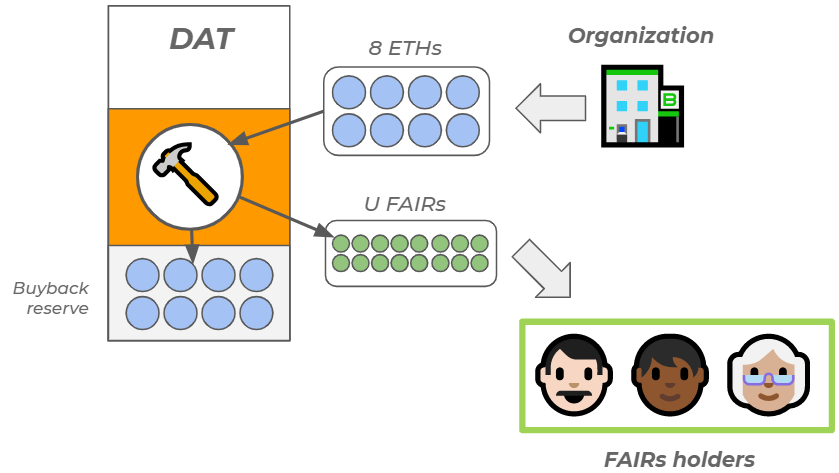
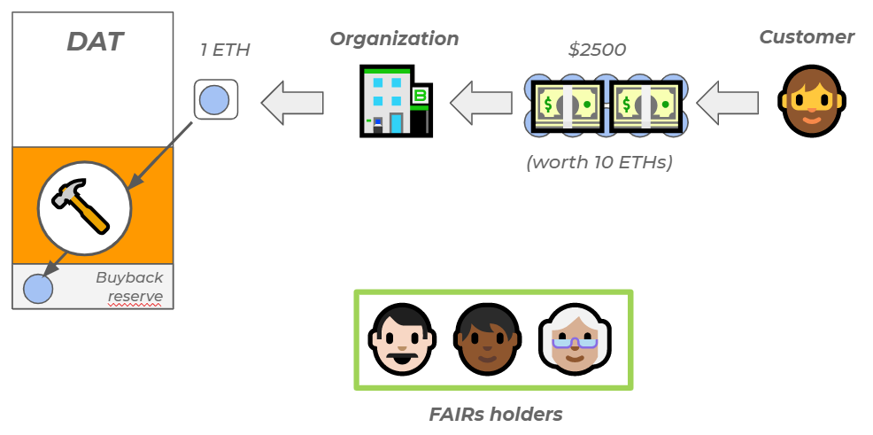
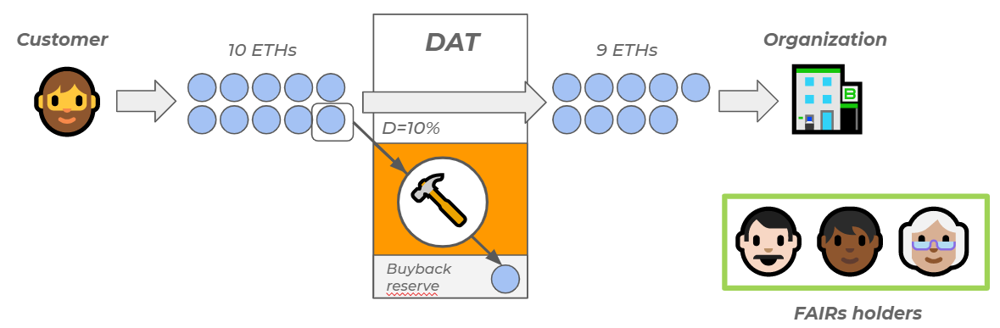
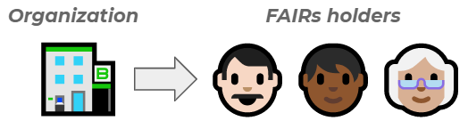

<h1>Continuous Organizations</h1>

_**FAIR Securities To Better Align Stakeholders' Financial Interests**_

_Author: [Thibauld Favre](https://twitter.com/thibauld)_

_Version 0.9_

<h3>Acknowledgments </h3>

This research is financially supported by [The Family](https://www.thefamily.co/).

Many thanks to the persons who kindly contributed to this research through their valuable feedbacks and insights: Pierre-Louis Guhur (_Student - ENS Cachan_) ● Marie Ekeland (_Founder - Daphni_) ● Tonje Bakang (_Founder - Afrostream, Partner - The Family, YC - Alumni_) ● Solomon Hykes (_Founder - Docker, Partner - YC_) ● Andrea Luzzardi (_Software Engineer - Docker_) ● Samuel Alba (_Senior Director of Engineering - Docker_) ● Joris Delanoue (_Founder - Nexteem_) ● Oussama Ammar (_Founder - The Family_) ● Alexandre Obadia (_Research - Cambrial_) ● David Fauchier (_Founder - Cambrial_) ● Minh Ha Duong (_Principal - Cambrial_) ● Florent Artaud (_Founder - Ekwity_) ● Willy Braun (_Co-Founder - Daphni_) ● Franck Le Ouay (_Founder - Lifen_) ● Duc Ha Duong (_Founder - Officience_) ● Dimitri De Jonghe (_Founder - Ocean Protocol_).

<h3>Abstract</h3>

The digital economy has radically changed the nature of the relationship between customers and corporations. Today's individuals have switched from being passive consumers to being an essential force in creating value, either by their actual work (think AirBnb, Uber, Apple app store, Amazon marketplace...) or through their data (Facebook, Google...). By leveraging their users' work, organizations in the digital economy have the ability to create  products with personalized user experiences that can sustain increasing returns to scale[1] while requiring little capital.

Unfortunately, today's organizations have no simple and efficient way to strongly align the interests of their users' workforce with the financial success of their organization. This is mostly due to today's securities' laws that impose high constraints and frictions when it comes to selling and distributing securities, especially to non-accredited investors.

To solve this issue, we propose a new paradigm: _Continuous Organizations_ (CO), a new type of organization designed to align the  stakeholders' interests significantly better than in traditional organizations. A _Continuous Organization_ is any kind of organization that issues fully digital securities called _FAIR Securities_ (**F**rictionless **A**greement for **I**nvestments and **R**eturns securities) by funneling part or all of its cash-flows to a _Decentralized Autonomous Trust_ (_DAT_). A _DAT_ is a smart-contract that automatically mints, burns and distributes _FAIR Securities_ (_FAIRs_) according to the organization cash-flows and predefined rules.

_Continuous Organizations_ present very interesting properties for all stakeholders:

*   **Founders** get a simple and efficient mechanism to strongly incentivize their community toward the financial success of their project, enhancing their capacity to create strong network effects, without affecting the governance of their organization.
*   **Employees** advantageously trade alienable illiquid stock options for inalienable liquid FAIR Securities (which can vest), truly aligning their interests to those of the organization.
*   **Early investors** receive their fair share of the upside in the case the organization is successful, without having to fear disproportionate dilution in the later bigger rounds.
*   **The community** of users, customers, suppliers, partners of the organization can be rewarded or simply invest in the organization in a friction-less and permission-less manner, thus aligning their interests with those of the organization.
*   **Regulators** can better protect their citizens from risky ICOs due to the 'security' nature of FAIR Securities while having the ability to simply tax revenues generated by Continuous Organizations.
*   **The environment** benefits from the decoupling of governance and financial interests proposed by the Continuous Organization model, allowing founders and their organizations to have a more long-term focus.

Even though the "security" nature of _FAIR Securities_ (FAIR Securities undeniably pass the [Howey test](https://en.wikipedia.org/wiki/SEC_v._W._J._Howey_Co.)) prevent organizations creating _Decentralized Autonomous Trusts_ today, we are confident that the _Continuous Organization_ model provides a strong enough value proposition that forward thinking jurisdictions around the world will be quick to adopt this new model.

<h3>Table of Contents</h3>

1. [Context](#context)
   1. [Organizations have evolved to adapt to the digital economy](#evolution)
   2. [The rise of the multitude](#multitude)
   3. [New challenges](#challenges)
      1. [For founders](#founders)
      2. [For employees](#employees)
      3. [For the multitude](#multitude)
      4. [For investors](#investors)
      5. [For the planet](#planet)
   4. [ICOs: a first (insufficient) answer to a real challenge](#ico)
      1. [The principle](#principle)
      2. [The good](#thegood)
      3. [The bad](#thebad)
      4. [The ugly](#theugly)
2. [Continuous Organizations](#continuousorganizations)
   1. [Understanding the token bonding curve model](#bondingcurve)
   2. [The Decentralized Autonomous Trust](#dat)
      1. [Investment - Buy](#buy)
      2. [Investment - Sell](#sell)
      3. [Dividends](#dividends)
      4. [Revenues](#revenues)
      5. [Summary](#summary)
   3. [Properties and incentives of a Continuous Organization](#properties)
   4. [Benefits](#benefits)
3. [Use cases](#usecases)
4. [Legal & Regulatory considerations](#legal)
5. [Attack vectors](#attacks)
   1. [Front-running attack](#frontrunning)
6. [Conclusion](#conclusion)

<h3 id="context">Context</h3>

<h4 id="evolution">Organizations have evolved to adapt to the digital economy</h4>

As the world is transitioning from the industrial age to the digital age, the legal structures that were invented and optimized to address the business needs of the industrial age are now showing their limits. Indeed, the digital economy has pushed organizations to adapt and transform their way of doing business to such extent that their nature has now completely changed:

<table>
  <tr>
   <td>
   </td>
   <td><strong>Industrial Age</strong>

<em>think "General Motors"</em>
   </td>
   <td><strong>Digital Age</strong>

<em>think "Airbnb"</em>
   </td>
  </tr>
  <tr>
   <td><em>Capital intensity</em>
   </td>
   <td>High 💲💲💲
   </td>
   <td>Low 💲
   </td>
  </tr>
  <tr>
   <td><em>Returns to scale</em>
   </td>
   <td>Decreasing <strong>↘</strong>
   </td>
   <td>Increasing <strong>↗</strong>
   </td>
  </tr>
  <tr>
   <td><em>Main assets</em>
   </td>
   <td>Tangible 🏭
   </td>
   <td>Intangible 💻
   </td>
  </tr>
  <tr>
   <td><em>Size of workforce</em>
   </td>
   <td>Large 🙋‍🙋‍🙋‍
   </td>
   <td>Small 🙋‍
   </td>
  </tr>
  <tr>
   <td><em>Location of workforce</em>
   </td>
   <td>Concentrated 🌆
   </td>
   <td>Distributed 🌎
   </td>
  </tr>
  <tr>
   <td><em>Type of jobs</em>
   </td>
   <td>Manual 🔧
   </td>
   <td>Intellectual 🧠
   </td>
  </tr>
  <tr>
   <td><em>Main growth driver</em>
   </td>
   <td>Cost 💵
   </td>
   <td>User experience 👌
   </td>
  </tr>
  <tr>
   <td><em>Tax contribution</em>
   </td>
   <td>High 💲💲💲
   </td>
   <td>Low 💲
   </td>
  </tr>
</table>

But despite this massive evolution of organizations, we still use the same type of legal entities to operate our businesses. These legal entities were designed within nation states to address the needs of organizations in the Industrial Age. They are ill-suited in the age of ubiquitous computing and networks, where organizations harness the power of the multitude to achieve increasing returns to scale, blurring the line between users and workers. To illustrate: an Uber driver is at the same time a user of Uber and a worker for Uber. Same goes for the renter of a flat on Airbnb. A Facebook user is also a Facebook (non-paid) worker etc...

<h4 id="multitude">The rise of the multitude</h4>

I could not put it better than [Nicolas Colin](https://www.ft.com/stream/3fd492f4-09b7-3f07-a744-b322b5bd015c), an esteemed colleague of mine at [The Family](https://thefamily.co/), in his book "[Hedge](https://www.amazon.com/Hedge-Greater-Safety-Net-Entrepreneurial/dp/1718917082/)":

> _«The key to understanding the digital economy is that it redistributes power from inside to the outside of organizations. A corollary to this law is that the business that succeed in the digital economy are the ones that realize how power has been redistributed outside of their organizations and learn to harness it anyway to fuel growth and profits.»_

To define the nature of this power, Nicolas Colin defined the concept of _multitude_ in a [previous book](https://www.amazon.com/gp/product/B00XDVC5X8/ref=dbs_a_def_rwt_bibl_vppi_i2) co-authored with Henri Verdier:

> _«The multitude is defined as the billions of individuals that are now equipped with increasingly powerful devices and connected with one another through wide networks.»_

In the digital economy, organizations rely on the multitude (ie. "Uber drivers", "Airbnb hosts", "Apple app store developers", "Facebook users"...) to thrive as a business yet the multitude has no vested financial interest in the wealth it contributes to create at the organization level. Instead, the multitude enters the "gig economy", defined by part-time jobs paid upon successful completion of a service. These jobs, which used to be very rare during the Industrial Age, are now becoming the new standard.

<h4 id="challenges">New challenges</h4>

The radical transformation of our organizations to adapt to the digital economy has created important challenges for all stakeholders that need to be addressed:

<h5 id="founders">🏃🏽‍For founders</h5>

> _"How can I incentivize my community to the long term success of my organization?"_

**Money**. As the multitude has become an essential part of the organization's' workforce in the digital economy, founders need new mechanisms to attract, retain and empower their community which is diverse and global. Many marketing tactics already exists but none of them allow for a long lasting solid alignment of interests between the organization and its community. The real solution, which would be to sell and/or distribute securities to the multitude is so legally complex under the current security laws that it is not a realistic option.

> _«Airbnb is a community-based company and we would be nothing without our hosts. We would like our most loyal hosts to be shareholders, but need these policies to change in order to make that happen.»_

The previous quote is from Brian Chesky, CEO of AirBnb, in statement about a [comment letter AirBnb addressed to the SEC](https://www.axios.com/airbnb-asks-sec-to-let-it-give-hosts-equity-a7d99495-0782-4bce-92bb-4c692ef1b621.html). 

> _"How can I create a long lasting trust relationship with my community?"_

**Trust**. To forge a long lasting a solid alliance with the multitude, organizations need to earn the trust of the multitude. However, as people understand more and more how the VC financial model works, it is becoming harder and harder for VC backed organizations to gain the trust of their community. Indeed, VCs interests are only aligned with that of the organization until investors need liquidity. Indeed, when investors need liquidity, the alignment of interests suddenly weakens as investors suddenly have the very short term interest of selling their share at the best price possible. As in [most cases](https://avc.com/2016/11/founder-dilution/), founders got heavily diluted and lost control of the organization, there is not very much they can do to prevent it.

<h5 id="employees">👩‍💻For employees</h5>

> "_I want a financial reward proportional to the risk I took and the value I create_"

**Fair value creation capture**. Unlike investors who have their investments diversified across a portfolio of organizations, employees are not diversified and only derive revenues from the organization they work for. Many schemes exists to align employees' interests to the financial success of the organization but most of them consists in providing illiquid and alienable conditioned securities or options on securities. The lack of liquidity in private organizations very often means that employees have to leave a lot of value (that they contributed to create) on the table when they leave the organization. 

<h5 id="multitude">🙋🏻‍For the multitude</h5>

> _"I wish I could be financially rewarded from this organization that I contribute to"_

**Long term wealth building & social security**. When a community (be they users, workers, partners, suppliers, customers...) fall in love with the product or service provided by an organization, they wish they could have the possibility to be financially rewarded for their active contributions to the product and build long term wealth as they help the organization grow. One-off referrals, coupons, goodies can only do so much… people want money! This is especially true in today's context where well-paid jobs with social security and 401Ks are becoming [the exception](https://www.wsj.com/articles/the-end-of-employees-1486050443?mod=djmc_pkt_ff&tier_1=21128300&tier_2=dcm&tier_3=21128300&tier_4=0&tier_5=4508749).

<h5 id="investors">👩🏿‍💼For investors</h5>

> _"I want the best return on investment for the risk I took"_

**Highest Return on Investment**. Investors really want one thing: the ability to sell their stake at the highest valuation possible. The investors' need for governance only comes from the fact their investments are illiquid and they need governance to protect it until a liquidity event comes. As long as they can sell their stake at the best price and in the timing they see fit, it is what [truly matters](https://austinstartups.com/venture-capital-economics-with-public-market-liquidity-c2dd5cd29ab6). Without liquidity, venture capital investment is a hit game, which consists in finding the one investment that will make exceptional returns and over-compensate for the vast majority of other investments who did not perform well or at all.

<h5 id="regulators">👨‍⚖️For regulators</h5>

> _"I want to help innovators, protect investors and collect my fair share of tax"_

**Innovators attraction. Investors protection. Taxes.** Regulators (usually) aim at providing innovators with a regulatory framework that help them create new services and products. One the key aspect of such a regulatory framework is to help innovators raise capital while giving investors reasonable legal protections against malconducts. Before the digital economy, this strategy would yield big returns through tax collection. Unfortunately for the regulators, the digital economy has made tax collection much more difficult. Indeed:

> _«The digital economy systematically disconnects the place of business from the place of consumption. Consequently, it is increasingly difficult to fix the location of the value created by this economy and to apply the rules of tax laws that are now outmoded.» source [Taxation of the Digital Economy - Pierre Collin & Nicolas Colin - 2013](https://www.hldataprotection.com/files/2013/06/Taxation_Digital_Economy.pdf)_

<h5 id="planet">🌎For the planet</h5>

> _"I want long-term thinking organizations"_

**Long-term energy efficient organizations**. Creating incentive mechanisms that could lead to organizations to optimizing for the long-term while keeping them accountable for their environmental impact would be highly beneficial for humanity as a whole. As of today, our inability to establish a global enforceable governance on environmental topics and the short-termism of today's financial markets, has made the [Tragedy of the Commons](https://en.wikipedia.org/wiki/Tragedy_of_the_commons) all too real. 

<h4 id="ico">ICOs: a first (insufficient) answer to a real challenge</h4>

In the recent years, the rise of cryptocurrencies has given birth to a new funding model for organizations: the Initial Coin Offering, an alternative to the traditional ways of financing.

<h5 id="principle">📝The principle</h5>

Simply put (and grossly generalized), organizations doing an ICO have more or less the following generic pitch:

> _«We created a (sometimes fixed) supply of millions of tokens on a blockchain. This tokens are not securities as we don't give investors any financial or voting rights. However, you can expect these tokens to have future value because we designed a system in which they will have the following utility. We are putting a certain number of tokens on sale to finance the development of the project. These tokens will be liquid very soon because we are going to be listed on exchange X. Buy our tokens.»_

<h5 id="thegood">👍The Good</h5>

The good part of ICOs is that, on the surface, they seem to very well align the interests of the main stakeholders in the organization:

*   **Founders** raise a lot of money without giving any governance rights, allowing them to pursue their vision. Thanks to the tokens they generated, they can create many financial incentives that are beneficial to the organization, from recruiting talents to enabling network effects that have the potential to grow their community exponentially. Some projects implemented on-chain governance or used a DAICOs to raise funds which gave token holders some governance rights, but they are more the exception than the rule.
*   **Investors** are also happy because they usually invest at a discounted valuation and their investment will likely become liquid quickly, when the token gets listed on one of the crypto-exchanges. This early liquidity allow them to drastically reduce their risk as they can decide to sell how and when they want, provided there is enough liquidity of course.
*   **Employees** are happy too because instead of stock-options, they can get tokens that nobody can take away from them and that are liquid. If you were lucky enough to work for a crypto project early enough, you had a decent chance of becoming millionaire in cash… not only on paper.

The problem of this model is that it works only if the token does have value… unfortunately, it is rarely the case!

<h5 id="thebad">👎The Bad</h5>

The problem is that it is very hard for the unsophisticated investor (and even the so-called 'sophisticated' ones!) to assess whether tokens will have any value at all. As a result, many retail investors, lured by the exceptional returns of a handful of well thought-out projects, burned themselves very badly.

Indeed, in most projects, the risk associated with investing in the project is an order of magnitude higher than the potential reward so the investment makes no financial sense. Here are a collection of the main very high risks associated with an investment in an ICO:

1.  _Is the team properly incentivized to create the product?_ In a lot of projects, founders give themselves a large number of tokens with no or little vesting. So if the ICO succeeds, the founders will get immediately rich and might very likely lose the motivation to actually create the product.
1.  _Will the team be able to create the product at all?_ The project is usually at its earliest stage with no product to show, only good intentions described in a document.
1.  _Can the product be created in the proposed timeline?_ Many projects massively underestimate the very impactful technical constraints posed by integrating a blockchain with a token in their system. 
1.  _Can the product achieve a good user experience?_ Most projects completely underestimates the UX constraints posed by integrating a token in their system.
1.  _If the product is delivered, will it be used at all?_ It is hard to know whether the team will achieve product/market fit.
1.  _If users like the product, will the token capture any value?_ The project could be wildly successful and yet the token have no value as it's not a security.
1.  _If the token has value, will it be a good investment?_ Most projects sell their tokens at an already very high valuation.

Given the above, it is expected that most projects will fail and are [bad](https://www.ccn.com/icos-raise-8-3-billion-last-quarter-and-most-of-them-were-abject-failures) [investments](https://docs.google.com/spreadsheets/d/1ioxvJgJiZui9ZD1nud2oLpClYCFcnzvgvMucI56uy-g/edit#gid=1772156349). Even worse: a project can be very successful yet his token have no value. This creates two important problems:

1.  **Retail investors get scammed** due the way the [_Shitcoin Waterfall_](https://soundcloud.com/unchainedpodcast/meltem-demirors-and-jill#t=51:03) works in ICOs
2.  **Regulators don't know how to regulate ICOs**. On the one hand, they welcome innovations that attract talents and investors but on the other hand, they don't like when retail investors get scammed.

<h5 id="theugly">💩The Ugly</h5>

At the time of writing this paper (September 2018), it is now established that, unless an ICO takes place within the context of a reputable platform (i.e. CoinList which is very selective or TokenFoundry to a lesser degree...), odds are that the ICO you are being pitched is a scam and you should be very cautious before investing in it. Indeed, due to the legal uncertainty around ICOs, the most promising projects now raise money privately and only use ICOs (or just pure Airdrops) as a way to boost their community building efforts.

It is sad to see that many ICOs actually on the market are scams. In the best case scenario, they are promoted by well intentioned founders who mistook an ICO for a Series A fundraising. In the worst case scenario, these ICOs are simply engineered by scammers trying to abuse unsophisticated investors to get rich quick. Needless to say that, in this context, it is hard not to see the ICO market for utility tokens [dying](https://coincentral.com/multibillion-dollar-ico-market-down/).

<h3 id="continuousorganizations">Continuous Organizations</h3>

A _Continuous Organization_ is an organization that issues fully digital securities called _FAIR Securities_ by funneling part or all of its cash-flows to a _Decentralized Autonomous Trust_ (_DAT_). A _DAT_ is a smart-contract that automatically mints, burns and distribute _FAIR Securities_ (_FAIRs_) following a token [bonding curve contract](https://medium.com/@justingoro/token-bonding-curves-explained-7a9332198e0e) with [sponsored burning](https://medium.com/@avsa/sponsored-burning-for-tcr-c0ab08eef9d4).

Important note about the currency used to interact with Continuous Organizations

**Note about the currency used to interact with a DAT**

In the following examples, we are using ETH (the currency of the Ethereum blockchain) as the currency to interact with the DAT. Indeed, ETH is the native currency for an Ethereum-based DAT. It does not mean that end users (individuals and organizations) will necessarily have to manipulate ETH to interact with DATs. One can envision a future where services are created to allow end users to use fiat currency like USD or EUR to interact with DAT, greatly simplifying the user experience. 

<h4>Understanding the token bonding curve model</h4>

Many individuals have explored [the](https://blog.oceanprotocol.com/introducing-the-equilibrium-bonding-market-e7db528e0eff) [bonding](https://tokeneconomy.co/token-bonding-curves-in-practice-3eb904720cb8) [curve](https://medium.com/@hayeah/code-analysis-of-fomo3d-pricing-and-dividends-6fb267bbf3a7) [model](https://medium.com/thoughtchains/on-single-bonding-curves-for-continuous-token-models-a167f5ffef89) since [Simon De La Rouvière](https://twitter.com/simondlr) first came up with [the idea](https://medium.com/@simondlr/tokens-2-0-curved-token-bonding-in-curation-markets-1764a2e0bee5) in 2017.

A _bonding curve contract_ is a specific type of smart-contract that issues its own tokens through **B**uy and **S**ell functions. To buy tokens, the buyer sends ETH to the Buy function which calculates the average price of the token in ETH terms and issues you with with the correct amount. The Sell function works in reverse: The contract will calculate the current average selling price and will send you the correct amount of ETH (excerpt taken from [Token Bonding Curves Explained](https://medium.com/@justingoro/token-bonding-curves-explained-7a9332198e0e)).

In the case of _Continuous Organizations_, the Buy and Sell functions are distinct:

A token bonding curve model has interesting properties, among which:

*   **Limitless supply**. There is no limit to the number of tokens that can be minted.
*   **Deterministic price calculation**. The buy and sell prices of tokens increase and decrease with the number of tokens minted.
*   **Guaranteed and immediate liquidity**. The bonding curve contract is the counterparty of the transaction and always holds enough ETH in reserve to buyback tokens. So tokens can be bought or sold instantaneously at any time, the bonding curve acting as an automated market maker.
*   **Continuous price**. The price of token n being inferior to the token n+1 and superior to the token n-1, calculating the number of tokens minted for a given amount of ETH (or the number of ETH sent back for a given amount tokens) require some integral calculus.

It is important to note that in a bonding curve model, the x-axis represents the **number of tokens issued**. To give a simple example, let's say `B(x)=x` and `S(x)=0`. The cost `C` to buy the first 10 tokens is given by the surface between the buy curve and the sell curve that we can be expressed as the following integral:

.

So, in our example: `C=10*10/2=50`.

<h4 id="dat">The Decentralized Autonomous Trust</h4>

In the case of _Continuous Organizations_, we introduce _cash-flow based bonding curve_: a bonding curve that uses 2 different functions, one for the buy curve and another for the sell curve: **B** (for **b**uy) and **S** (for **s**ell) with S(x)&space;\forall&space;x&space;\in&space;[0;\infty[" />.

The bonding curve contract of a _Decentralized Autonomous Trust_ issues _FAIR Securities_ (_FAIRs_). These _FAIR Securities_ represent a claim on the _DAT_'s future cash-flows. It is important to note that, unlike a stock, a _FAIR_ does not represent a claim on the organization ownership, it only carries a financial right on the future cash-flows managed by the _DAT_.

The function _B_ defines the price at which _FAIRs_ can be bought from the _DAT_. _B_ is a linear function and has a positive slope **_b_** such that `B(x)=b*x` where  and `b>0`. The slope _b_ can be chosen arbitrarily. The higher _b_ is, the more value unit tokens will have and vice-versa the lower _b_ is, the less value unit tokens will have.

If you want your investors to have a lot of tokens, pick a very small value for b (like 1x10^(-9)). It has no financial impact, it only allows higher granularity for fractional ownership.

The function _S_ defines the price at which _FAIRs_ are bought back by the _DAT_. _S_ is a linear function as well and has a slope **_s_** such that `S(x)=s*x` where  and `s>0`. However, in a _Continuous Organization,_ the value of _s_ increases discretely over time ie . To explain how the value of _s_ increases over time, it is important to understand that a _DAT_ receives and processes the cash-flows it receives.

<h5 id="buy">📈 Investments - Buy</h5>

The first (in "time", not in "proportion") source of cash-flow for a Continuous Organization are investors who want to invest in the _Continuous Organization_. Whenever an investor sends funds to the _DAT_, a fraction of the funds sent is being held in the "buyback" reserve by the _DAT_ and the rest of the funds are being transferred to the organization's wallet. We'll call **I** (for **i**nvest) the percentage of the funds being held with . Please note that I is a function of s0, the slope of S at `t=0`, and not st so I is constant.

_Value flow when an investment occurs_

_Impact on the Bonding Curve Contract of the DAT when an investment occurs_

The investors buying tokens are doing so to invest money in the underlying organization. Investors don't want their money to be held in reserve by the _DAT_, they want their money to be put to good use by the organization. Consequently, the value of _s_ must be an order of magnitude lower than _b_.

_Example_: let's say that an investor sends 10 ETH to the _DAT_, if I=10% then the _DAT_ will transfer 9 ETH to the organization's wallet and will keep 1 ETH in its "buyback" reserve.

<h5 id="sell">💰 Investments - Sell</h5>

Investors can at any time decide to sell their FAIRs to get ETH back. When the DAT receives _FAIRs_, it burns the received _FAIRs_ and sends ETH back to the selling investor according to a function **S** (for **s**ell). _S_ has a slope _s_ that increase discretely over time, every time the _DAT_ receives a payment. The ETH sent back to the investor is taken from the _DAT_ "buyback" reserve and does **not** affect the organization's cash reserve.

_Value flow when a FAIR sale occurs_

_Impact on the Bonding Curve Contract of the DAT when an investor sells its tokens_

<h5 id="dividends">💵 Dividends</h5>

The second source of cash-flow for the _DAT_ are dividends. At any point in time, the organization can decide to pay dividends to its _FAIRs_ holders. To do so, the organization sends ETH to the _dividend_ function of the _DAT_. Two things happen:

1.  **The _DAT_ buyback reserve is increased**. All the funds sent are used in to mint new _FAIRs_ with a _contribution ratio_ of 100%, meaning that 100% of the funds sent are being saved in the _DAT_ buyback reserve, thus creating value to _FAIRs_ holders by increasing the slope of the selling curve (see detailed explanation below).
2.  **_FAIRs_ holders receive dividends in _FAIRs_**. The newly minted FAIRs are distributed as dividends to the current _FAIRs_ holders pro-rata of their holdings and taking into account any "_dividend bonus_" they might have (see below for the definition of "_dividend bonus_").

_Value flow when a dividend payment occurs_

The biggest difference between an investment cash-flow and a dividend cash-flow is their respective _contribution ratio_ to the _DAT_'s reserve:

1.  **investment**: an amount M contributes `I*M` to the _DAT_'s reserve while minting the value equivalent of M, thus a contribution ratio of `(I*M)/M=I` and by construction I<<100%
2.  **dividend**: an amount M contributes `M` to the _DAT_'s reserve while minting the value equivalent of `M`, thus a contribution ratio of `M/M=100%`

So we have  (remember from above that st is the slope of the sell function at time _t_). As we saw that s0=I it means that, everytime a dividend is received by the _DAT_, _s_ increases in value. After each transaction, _s_ can be recalculated from the amount in reserve Rt:

so 

 _(proof available in Annex)_ 

_Example_: Say I=10%, D=10% and b=1. Assume an investor buys the first 10 tokens for 50 ETH, so the _DAT_ now has 50*10%=5 ETH in reserve. Then, the _DAT_ receives a payment of 10 ETH from revenues. From this payment, 10*10%=1 ETH is used to mint 0.0995 token (we leave this as an exercise to the reader. Hint: the equation to solve is ), which gives s1=0.1176 which is indeed superior to I.

<h6>Dividend bonus</h6>

Finally, to incentivize long term _FAIR_ holders, the _DAT_ also has a dividend bonus mechanism that enables long-term token holders to enjoy a higher dividend than short term token holders. The mechanism is the following: every month an investor holding a _FAIR _sees its dividend bonus increase until the maximum dividend bonus **M** is reached after holding your _FAIR_ for **H** months. When a FAIR is sold or transferred, M is reset to 0.

<h5 id="revenues">💲 Revenues</h5>

For some _Continuous Organizations_ (_COs_ with no underlying legal entity for example), it can make sense to perceive their customers' payments (i.e. the _CO_'s revenues) through the _DAT_. It is important to note, that it is not mandatory to funnel the organization's revenues through the _DAT_ as the organization can also decide to _only_ reward _FAIR_s holders through dividends.

For organizations that already have a running business, they will very likely prefer to _first_ perceive the payment from their customer in fiat (as they usually do, without changing their selling process) and will _then_ transfer a fraction D of their perceived revenues to the DAT in the form of dividends like illustrated on the following schema:

This way, the _DAT_ is made completely invisible for the customer (no change in UX) and the organization does **not** have to modify any of its highly optimized selling processes.

Whenever the _DAT_ receives a payment **P**, a fraction of the payment received is being used to _mint new FAIRs_. We'll call **D** (for **d**ividends) the percentage of the revenues being used to mint new tokens, **d** the corresponding fraction of the revenues (d=P*D) and **t** the number of new tokens minted. The entire amount d used to mint _FAIRs_ is saved in the _DAT_'s "buyback" reserve and the **t** _FAIRs_ minted are distributed to the current token holders according to their current holdings as well as their dividend bonus (see below). This distribution is like a dividend distribution but paid in _FAIRs_ rather than ETH.

_Value flow when the CO relies on the DAT to perceive its payments_

_Example_: Suppose D=5%, if the _Continuous Organization_ receives a payment of 100 ETH, 5 ETH will be used to mint _FAIRs_. The _FAIRs_ are then distributed to existing token holders who can decide to either keep or sell them.

<h5 id="pre-mint">🍯Pre-minted FAIR pool</h5>

When the _DAT_ is being created (and **only** then because once created the _DAT_ becomes immutable), the organization can decide to "pre-mint" for itself and for free a number **PM** of _FAIRs_. That means that, instead of having the supply of _FAIRs_ of the _DAT_ starting from zero, it would start from PM.

Pre-minting FAIRs can often make a lot of sense to the organization, be it to reward its founders or to pay its early employees or reward its early users etc… However, it is very important to realize that pre-creating FAIRs comes with a potentially high cost: Indeed, these "free" pre-minted _FAIR_s represent a selling pressure on the _DAT_ as they are _FAIR_s that got allocated "for free", without any contribution to the _DAT_ buyback reserve.

Technically speaking, it means that the higher the number of FAIR tokens are pre-minted, the lower will sell curve be (i.e. the _s_ slope defined previously). So, concretely, if an organization decides to pre-mint a large number of FAIRs when setting up the DAT, it may want to be very careful not to pre-mint too many of them because it significantly increases the risk and financial reward of investors.

_Impact of pre-minted tokens, everything else being equal_

Even though it is not mandatory, it is highly recommended to have a vesting schedule for the _FAIR_s that are pre-minted in order to to commit their beneficiaries on the long-term and help them resist the temptation to sell at the first opportunity.

<h5 id="summary">📄 Summary</h5>

A _Continuous Organization_ is an organization that issues _FAIR securities_ by funneling part or all of its cash-flows to a specific type of smart-contract called _Decentralized Autonomous Trust_ (_DAT_). These _FAIR Securities_ represent a claim on the _DAT_'s future cash-flows. The organization, its investors and, potentially, its customers interact with the _DAT_ by sending ETH or _FAIRs_ to it:

<table>
  <tr>
   <td>Source of cash-flow
   </td>
   <td>What happens at the <em>DAT</em>?
   </td>
  </tr>
  <tr>
   <td>

>>>>>  gd2md-html alert: inline image link here (to images/Introducing-Continuous11.png). Store image on your image server and adjust path/filename if necessary.  (<a href="#">Back to top</a>)(<a href="#gdcalert64">Next alert</a>) >>>>> 

<em>Investment (buy)</em>
   </td>
   <td>▪ The <em>DAT</em> receives ETH from the buying investor

▪ The <em>DAT</em> mints new FAIRs and send them to the buying investor.

▪ The sum invested is in part distributed to the beneficiary organization and in part saved in the <em>DAT</em> "buyback" reserve according to a pre-defined immutable function <strong>I</strong> (for <strong>i<em>nvestment</em></strong>).
   </td>
  </tr>
  <tr>
   <td>

>>>>>  gd2md-html alert: inline image link here (to images/Introducing-Continuous12.png). Store image on your image server and adjust path/filename if necessary.  (<a href="#">Back to top</a>)(<a href="#gdcalert65">Next alert</a>) >>>>> 

<em>Investment (sell)</em>
   </td>
   <td>▪ The <em>DAT</em> receives FAIR securities from the selling investor

▪ The <em>DAT</em> burns the received <em>FAIR</em>s and sends ETH back to the selling investor according to a function <strong>S</strong> (for <strong>s</strong>ell). <em>S</em> has a slope <em>s</em> that increase discretely over time, every time the <em>DAT</em> receives a payment.

▪ The ETH sent back to the investor is taken from the <em>DAT</em> "buyback" reserve and does <strong>not</strong> affect the organization's cash reserve.
   </td>
  </tr>
  <tr>
   <td>

>>>>>  gd2md-html alert: inline image link here (to images/Introducing-Continuous13.png). Store image on your image server and adjust path/filename if necessary.  (<a href="#">Back to top</a>)(<a href="#gdcalert66">Next alert</a>) >>>>> 

<em>Dividend payment</em>
   </td>
   <td>▪ the <em>DAT</em> receives ETH from the organization

▪ the <em>DAT</em> uses the funds to mint new <em>FAIR</em>s and distribute them to the current <em>FAIR</em> holders according to their holdings and their respective dividend bonuses.

▪ The funds used to mint the <em>FAIR</em>s are being saved in the <em>DAT</em> "buyback" reserve.
   </td>
  </tr>
  <tr>
   <td>

>>>>>  gd2md-html alert: inline image link here (to images/Introducing-Continuous14.png). Store image on your image server and adjust path/filename if necessary.  (<a href="#">Back to top</a>)(<a href="#gdcalert67">Next alert</a>) >>>>> 

<em>Revenues</em>
   </td>
   <td>▪ The <em>DAT</em> receives a payment from a customer

▪ The <em>DAT</em> transfers the revenues to the organization but retains a fraction <strong>D</strong> (for <strong>d<em>ividends</em></strong>) of the revenues to mint new <em>FAIR</em>s

▪ The new <em>FAIR</em>s are distributed among the existing <em>FAIR</em>s holders. 

▪ 100% of the funds used to mint the new <em>FAIR</em>s are saved in the <em>DAT</em> "buyback" reserve.
   </td>
  </tr>
</table>

Finally, a _DAT_ can be created with pre-minted FAIRs allocated to the organization that can then distribute them freely to stakeholders. However, it is important to note that these pre-minted FAIRs come at a cost as their are directly diluting future investors.

<h4>Properties and incentives of a Continuous Organization</h4>

<h5>🌲 Long-term investment focus</h5>

The spread that exists between the buy price and the sell price of _FAIR_s creates an incentive for investors to buy and hold _FAIR_s until the _Continuous Organization_ starts generating revenues:

1.  **Pre-revenue**. The price appreciation of _FAIR_s is due to investors' speculation as they anticipate future revenues.
1.  **Post-revenues**. Once revenues begin to flow, the price appreciation of _FAIR_s starts being driven by the revenues generated by the organization as a fraction of the revenues is used to buy _FAIR_s and distribute them as dividends to the current token holders.

Combined with the dividend bonus described earlier, there is a clear incentive for investors to hold their tokens and act as long-term investors yet still retain liquidity power if they want to.

<h5>🤝Secondary market</h5>

The spread between the Buy and Sell curves also leaves space for a secondary market of _FAIR_s. If the current price of a newly minted _FAIR_ is 10, an investor would rather buy an already minted _FAIR_ from another investor willing to sell at a better price than the buyback price offered by the _DAT_.

Obviously, this secondary market is bounded in a dynamic price range imposed by the _DAT_: it would not make sense for a buyer to bid for a price higher than the current price proposed by the _DAT_. Likewise, it would not make sense for a seller to ask for a price lower than the price proposed by the _DAT_. 

>>>>>  gd2md-html alert: inline image link here (to images/Introducing-Continuous15.png). Store image on your image server and adjust path/filename if necessary.  (<a href="#">Back to top</a>)(<a href="#gdcalert68">Next alert</a>) >>>>> 

Said otherwise, an investor will always be better off buying or selling its _FAIRs_ in the secondary market, as the price will likely be better than the price proposed by the _DAT_.

<h5>💧Guaranteed liquidity</h5>

One of the most valuable property of a _Continuous Organization_ is that the liquidity of _FAIR_s is immediate and guaranteed. If an investor does not find a buyer or a seller in the secondary market, he can always buy or sell tokens to the _DAT_. By construction, the _DAT_ always has the funds to buyback _FAIR_s at a price defined by the _S_ function. The _DAT_ really acts as the organization's central bank, minting new tokens when demand exceeds available supply and contracting the token supply when sellers outnumber buyers.

In the proposed bonding curve model the buyback price (defined by the _S_ function) at a given supply is very low compared to the buy price (the _B_ function). So one could argue that, even if there is guaranteed liquidity, this liquidity has limited utility because investors would likely take a loss by selling to the _DAT_. This is true only if an investor buys _FAIR_s and sell them back to the _DAT_ short after after.

However, if the investors has more patience and if the organization develops well::

1.  more investors will buy _FAIR_s, thus increasing both the buy and the sell price to where the investor will turn a profit by selling its _FAIR_s back to the _DAT_.
1.  the organization will start generating revenues, thus automatically distributing token dividends (using the mechanism described previously).
1.  the organization can also start distributing dividends directly if it is doing well and sees an interest in doing so.

Distributing token dividends has a double effect:

    1.  significantly increasing sell price because these dividend tokens are bought from the _DAT_ and the funds are 100% saved in the buyback reserve, thus increasing the value of _s_ and with it the minimum sell price.
    1.  increasing the investor's return on investment (ROI) as the investors can decide to immediately sell back the dividend tokens he received to cash them out.

Finally, it is good to keep in mind that the _DAT_ is only the last resort buyer. For a given supply, it is very likely that an investor could sell his tokens at a higher price than the price of the _DAT_ on the secondary market.

<h5>💰 Continuous fundraising</h5>

By construct, a _Continuous Organization_ is continuously fundraising as investors can permission-lessly buy and sell _FAIR_s of the organization at any time:

*   Any increase in _FAIR_ supply (i.e. a _FAIR_ that is being minted by the _DAT_, not bought on the secondary market) directly translates into funding for the organization.
*   Any decrease in _FAIR_ supply (i.e. a _FAIR_ that is being sold to the _DAT_, not sold on the secondary market) is being paid by the buyback reserve of the _DAT_ and does not affect the treasury of the organization.

Whereas in the traditional VC financing model, fundraising defocuses the entrepreneur in a time-consuming and uncertain process that creates dangerous valuation thresholds, COs help the entrepreneur stay focused on execution and make the organization more resilient to the business ups and downs.

To illustrate this, let's take the example of a _Continuous Organization_ which token price as measured by the buy function of the DAT follows the following very volatile curve **over time**:

 

>>>>>  gd2md-html alert: inline image link here (to images/Introducing-Continuous16.png). Store image on your image server and adjust path/filename if necessary.  (<a href="#">Back to top</a>)(<a href="#gdcalert69">Next alert</a>) >>>>> 

The zones in **blue** correspond to upward trends of the _FAIR_ price, which translates into the _Continuous Organization_ raising funds. Alternatively, the white zones are downward trends which translates into the _DAT_ (**not** the organization) buying back the _FAIR_s that are being sent to it using its buyback reserve.

<h3>Benefits</h3>

_Continuous Organizations_ provide many benefits over traditional organizations for all stakeholders, most notably:

<table>
  <tr>
   <td>Stakeholder
   </td>
   <td>Benefits
   </td>
  </tr>
  <tr>
   <td>🏃🏽‍

<em>Founders</em>
   </td>
   <td>▪ Build solid incentives to grow and strengthen your community

▪ Recruit talents more easily anywhere in the world

▪ Keep long-term control of your organization

▪ Make your organization more resilient against business ups and downs

▪ Be less distracted (legal, fundraising) and focus more on execution.

▪ Get personal liquidity (once vested).
   </td>
  </tr>
  <tr>
   <td>👩‍💻

<em>Employees</em>
   </td>
   <td>▪ Align your personal financial interest with that of the organization

▪ Sell your FAIRs when it makes sense for you
   </td>
  </tr>
  <tr>
   <td>🙋🏻‍

<em>The multitude</em>
   </td>
   <td>▪ Get a share of the value created if the organization is successful

▪ Enjoy the same long-term financial benefits as employees do
   </td>
  </tr>
  <tr>
   <td>👩🏿‍💼

<em>Investors</em>
   </td>
   <td>▪ Reduce your investment risk using the FAIRs liquidity

▪ Sell your FAIRs at public market price

▪ Sell your FAIRs at the pace you want

▪ Invest anywhere in the world
   </td>
  </tr>
  <tr>
   <td>👨‍⚖️

<em>Regulators</em>
   </td>
   <td>▪ Favor innovation in your jurisdiction to create new products and services

▪ Protect your citizens from scams with FAIR

▪ Collect taxes easily at the DAT level
   </td>
  </tr>
  <tr>
   <td>🌎

<em>The planet</em>
   </td>
   <td>▪ Founders can keep long-term control of their organization

▪ Investors are incentivized on the long-term

▪ Continuous Organizations are more inclusive than traditional organizations
   </td>
  </tr>
</table>

<h3></h3>

<h3>Use cases</h3>

Ultimately, once the concept will be more mature, we believe that COs have the potential to become the de-facto standard form of organization for founders looking to start a new venture, be it nonprofit or for-profit. Until then, we think there are some use cases that could already make a lot of sense now, most notably:

1.  **Long-term employee incentivisation**. Incentivizing employees is a key topic in any successful organization. Unfortunately, today's mechanisms are far from being perfect, especially for private organizations which shares are not publicly listed. Instead of giving employees equity directly or via stock options, an organization could use a _DAT_ to provide their employees with inalienable, liquid _FAIR_s aligned to the success of the organization.
1.  **Organizations with large contributive communities**. As of now, it is very difficult legally and technically to financially incentivize communities. If you have a platform business at a late stage (AirBnb, Uber, Yelp-like...) and wish to further engage your community in your platform, you start a _CO_ by setting up a _DAT_. Obviously, you would not funnel 100% of your revenues to the _CO_ immediately but maybe commit to buy every month a certain amount of tokens of the _DAT_. This way, you can very simply financially align your community to the success of your business. Plus, you can use the _FAIR_s to distribute them in the way you prefer to your community / employees etc... 
1.  **Early startups bootstrapping their network effect**. Startup founders who develop marketplaces or any sort of 2-side networks always face a chicken-and-egg problem. By setting up a _CO_ and using _FAIR_s, they can solidly incentivize early adopters to join and contribute by aligning them to the long-term success of the project. Unlike today, FAIRs give early adopters the unique opportunity to get a fair part of the the upside of the platform value they contribute to create by joining and contributing early.
1.  **Real estate tokenization**. Given that investors in a _Continuous Organizations_ are buying _FAIR_s in anticipation of future cash-flows, it would make a lot of sense to use _CO_s to buy and tokenize real estate. Indeed, real estate is a well-known provider of steady and predictable cash-flows so such a project could create a CO to finance the acquisition of the real estate and provide its investors with predictable returns.
1.  **Organization-less online communities**. You don't need a pre-existing organization to create a _CO_, nor do you need to incorporate one. Let's say you have a business idea and want to start a _CO_ out of a pure online community. The beneficiary of the _DAT_ could be simply a multisig wallet with the project leaders, the _DAT_ would pre-mint _FAIR_s to distribute/incentivize the community and the **D** parameter of the _DAT_ would be set rather high to yield strong token dividends to the community when revenues are generated.

<h3>Legal & Regulatory considerations</h3>

A _Continuous Organization_ rely on a _Decentralized Autonomous Trust_ (DAT) to operate so it is important to legally define this DAT and its various properties. Be careful about what is written in this section as it only reflects the author's opinion and is **definitely not** a legal opinion. If you have a legal opinion regarding your jurisdiction, please come and [engage with us](https://chat.c-org.co) in our discussion forum.

<h4>DAT and assets</h4>

It is our belief that it should be pretty straightforward to transfer assets like intellectual property, shares, contracts etc... to a _DAT_. Having the ability to legally transfer assets to the _DAT_ would open the door to a lot more use cases and scenarios for _Continuous Organizations_.

<h4>DAT and regulations</h4>

As a _Decentralized Autonomous Trust_ has no governance, it does not belong to anyone per se. To our knowledge, it has no equivalent in today's laws and is a new financial instrument. By spirit, it is close to an _Irrevocable Trust_[^27] with the code acting as the Trustee, the organization as the _Grantor_ and the _FAIR_s holders as the _Beneficiaries_. On top, an _Irrevocable Trust_ has no legal entity, it is just a contract, like a DAT. However the comparison has its limit: Contrary to a _DAT_, an _Irrevocable Trust_ is not a vehicle in which investors can invest to receive securities on the Trust's assets.

To make it legally safe for organizations to use _DAT_s, we will likely have to work with regulators to have _DAT_s recognized and regulated as a new financial instrument. Even though it may sound difficult at first sight, we are confident that it is a reachable goal given the solid value proposition of _DAT_s for regulators (see the reasons in 

>>>>>  gd2md-html alert: undefined internal link (link text: "Benefits"). Did you generate a TOC?  (<a href="#">Back to top</a>)(<a href="#gdcalert70">Next alert</a>) >>>>> 

[Benefits](#heading=h.rpkk6jhnge3u)).

It is our belief that regulators will at least require a full KYC/AML for FAIRs holders as well as a reasonable tax withholding on the cash-flows that are managed by the _DAT_ (?). If you are a regulator or have strong knowledge and competencies in this area, please feel free to leave us a message [in our forum](https://chat.c-org.co), we are definitely wanting to work hand-in-hand with regulators around the world to make _Decentralized Autonomous Trusts_ a legal reality.

<h3></h3>

<h3>Attack vectors</h3>

<h4>Front-running attack</h4>

As perfectly stated in Relevant's blog[^28]:

    _«Bonding curves are susceptible to front-running attacks. This is when an adversary watches for a big buy order coming in and sends her own buy order with more gas to cut ahead of the original order. Once the original order is executed, the attacker sells her tokens at a guaranteed profit.»_

One simple solution to these attacks is to set an upper limit on the amount of gas buyers and sellers can use in their transaction. Another, more robust but also more complex to implement, would be to implement a regular price fixing: Instead of the orders being executed immediately, they are instead batched into a pool of orders and, every _<interval>_ hours, the contract executes the trades taking into account the orders registered in the order book. It means that the trades are not executed immediately but it has the immense advantage of preventing front-running attacks. This is how the Gnosis DutchX Decentralized exchange works[^29]:

    _«Hence, with batched orders entering the block at the time the auction clears with the same price for all bidders and sellers , neither miners nor the exchange itself, or other participants will be able to game the system.»_

Such a system would not penalize liquidity much if the price fixing is regular enough (every 6 hours in the case of DutchX) and has the huge advantage of preventing front-running.

<h3>Conclusion</h3>

Any type of organization, for-profit and nonprofit, can become a _Continuous Organizations_ by setting up a _Decentralized Autonomous Trust_ and funneling all or part of its cash-flows to it. _Continuous Organizations_ are a new type of internet-native organisations that are more efficient, stable and inclusive than traditional organisations. At the heart of _Continuous Organizations_ are fully digital liquid securities that align stakeholders' interests better than traditional organisations. _Continuous Organizations_ are easy to incorporate and their properties make them ideal to incentivize employees, grow and strengthen communities, create virtual online organisations.

To continue the conversation and contribute, you are more than welcome to our [online forum](https://chat.c-org.co). You can also interact with us on [twitter](https://twitter.com/ContinuousOrg).

<h2></h2>

<h2>Annexes</h2>

How to recalculate s, from R after each new transaction:

>>>>>  gd2md-html alert: inline image link here (to images/Introducing-Continuous17.png). Store image on your image server and adjust path/filename if necessary.  (<a href="#">Back to top</a>)(<a href="#gdcalert71">Next alert</a>) >>>>> 

## Notes

[1]: the definition of Returns to Scale on [Wikipedia](https://en.wikipedia.org/wiki/Returns_to_scale)

[2]: FAIR: Frictionless Agreement for Investments and Returns

[3]: FAIR Securities undeniably pass the [Howey test](https://en.wikipedia.org/wiki/SEC_v._W._J._Howey_Co.)

[4]: To illustrate: an Uber driver is at the same time a user of Uber and a worker for Uber. Same goes for the renter of a flat on Airbnb. A Facebook user is also a Facebook (non-paid) worker.

[5]: Nicolas Colin is a regular contributor to the [Financial Times](https://www.ft.com/stream/3fd492f4-09b7-3f07-a744-b322b5bd015c) and [Forbes](https://www.forbes.com/sites/nicolascolin/#7ae88301c3b1) 

[6]: [The Family](https://thefamily.co) is a european organization educating, protecting, and financing ambitious Entrepreneurs

[7]: [Hedge, A Greater Safety Net for the Entrepreneurial Age](https://www.amazon.com/Hedge-Greater-Safety-Net-Entrepreneurial/dp/1718917082/) 

[8]: [L'age de la multitude - Entreprendre et gouverner après la révolution numérique](https://www.amazon.com/gp/product/B00XDVC5X8/ref=dbs_a_def_rwt_bibl_vppi_i2) (not translated in english)

[9]: [Airbnb asks SEC to let it give hosts equity](https://www.axios.com/airbnb-asks-sec-to-let-it-give-hosts-equity-a7d99495-0782-4bce-92bb-4c692ef1b621.html)

[10]: In the 'best case scenario' liquidity event which is the IPO, "[the average founder ownership at IPO was 17% and the average VC ownership at IPO was 56%](https://avc.com/2016/11/founder-dilution/)"

[11]: [The End of Employees](https://www.wsj.com/articles/the-end-of-employees-1486050443?mod=djmc_pkt_ff&tier_1=21128300&tier_2=dcm&tier_3=21128300&tier_4=0&tier_5=4508749)

[12]: See Multicoin Capital "[Venture Capital Economics with Public Market Liquidity](https://austinstartups.com/venture-capital-economics-with-public-market-liquidity-c2dd5cd29ab6)"

[13]: Quote from [Taxation of the Digital Economy](https://www.hldataprotection.com/files/2013/06/Taxation_Digital_Economy.pdf) - Pierre Collin & Nicolas Colin - 2013

[14]: See [Tragedy of The Commons definition on wikipedia](https://en.wikipedia.org/wiki/Tragedy_of_the_commons)

[15]: Some projects have on-chain governance or used a DAICOs to raise funds which gave token holders some governance rights, but there are more the exception than the rule

[16]: ...and also for the so-called sophisticated investors!

[17]: [ICOs raised a record $8.3B in Q2 2018 but most of them were abject failures](https://www.ccn.com/icos-raise-8-3-billion-last-quarter-and-most-of-them-were-abject-failures)

[18]: [Public - ICO Returns 2014-2018](https://docs.google.com/spreadsheets/d/1ioxvJgJiZui9ZD1nud2oLpClYCFcnzvgvMucI56uy-g/edit#gid=1772156349)

[19]: [Meltem Demirors explains the ShitCoin Waterfall on Laura Shin's podcast](https://soundcloud.com/unchainedpodcast/meltem-demirors-and-jill#t=51:03)

[20]: [Multibillion dollar ICO market down to a few hundred million](https://coincentral.com/multibillion-dollar-ico-market-down/)

[21]: [Token Bonding Curves Explained](https://medium.com/@justingoro/token-bonding-curves-explained-7a9332198e0e)

[22]: [Sponsored Burning for TCRs](https://medium.com/@avsa/sponsored-burning-for-tcr-c0ab08eef9d4)

[23]: [equilibrium bonding market](https://blog.oceanprotocol.com/introducing-the-equilibrium-bonding-market-e7db528e0eff), [dynamic bonding curve](https://tokeneconomy.co/token-bonding-curves-in-practice-3eb904720cb8), [fomo3d](https://medium.com/@hayeah/code-analysis-of-fomo3d-pricing-and-dividends-6fb267bbf3a7) [etc](https://medium.com/thoughtchains/on-single-bonding-curves-for-continuous-token-models-a167f5ffef89)...

[24]: [Simon De La Rouvrière](https://twitter.com/simondlr)

[25]: [Tokens 2.0 - Curved Token Bonding in Curation Markets](https://medium.com/@simondlr/tokens-2-0-curved-token-bonding-in-curation-markets-1764a2e0bee5) 

[26]: Excerpt adapted from the article [Token Bonding Curves Explained](https://medium.com/@justingoro/token-bonding-curves-explained-7a9332198e0e)

[27]: See the definition of [Irrevocable Trust](https://www.investopedia.com/terms/i/irrevocabletrust.asp) on investopedia

[28]: [How to make bonding curves for continuous tokens](https://blog.relevant.community/how-to-make-bonding-curves-for-continuous-token-models-3784653f8b17)

[29]: [The main benefits of the DutchX mechanism](https://blog.gnosis.pm/the-main-benefits-of-the-dutchx-mechanism-6fc2ef6ee8b4)
