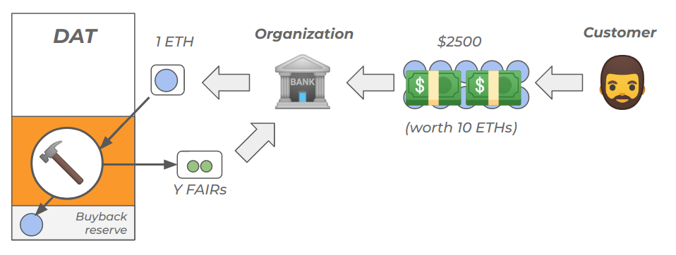
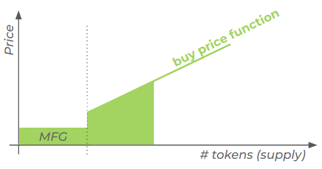

<h1>Continuous Organizations</h1>

_**Aligning stakeholders’ financial interests in the Digital Economy**_

Author: _[Thibauld Favre](https://twitter.com/thibauld)_

Version: _1.2_

Last update: _Oct 17th 2019_

Keywords: _FAIR Securities, Continuous Securities Offering, Decentralized Autonomous Trust, Bonding Curve Smart-Contract, Multitude_

<h3>Acknowledgments</h3>

A special acknowledgement to [Joris Delanoue](https://twitter.com/Joris_DLN), my co-founder at Fairmint who relentlessly challenged the model since version 1.0 was published. Version 1.2 of this whitepaper really reflects the results of those sometimes heated but always fruitful discussions.

This research is financially supported by [Fairmint](https://fairmint.co).

Finally, many thanks to those persons who have kindly contributed to this research through their valuable feedbacks and insights: Pierre-Louis Guhur (_Student - ENS Cachan_) ● Marie Ekeland (_Founder - Daphni_) ● Tonje Bakang (Partner - The Family) ● Solomon Hykes (_Founder - Docker_) ● Andrea Luzzardi (_Software Engineer - Docker_) ● Samuel Alba (_Senior Director of Engineering - Docker_) ● Oussama Ammar (_Founder - The Family_) ● Alexandre Obadia (_Research - Cambrial_) ● David Fauchier (_Founder - Cambrial_) ● Minh Ha Duong (_Principal - Cambrial_) ● Florent Artaud (_Founder - Ekwity_) ● Willy Braun (_Co-Founder - Daphni_) ● Franck Le Ouay (_Founder - Lifen_) ● Duc Ha Duong (_Founder - Officience_) ● Dimitri De Jonghe (_Founder - Ocean Protocol_) ● Jérôme de Tychey (_Blockchain tech Lead - Consensys_) ● Kyle Hall (_Writer - The Family_) ● Billy Rennekamp ● Roxana Danila.

<h3>Abstract</h3>

The digital economy has radically changed the nature of the relationship between customers and corporations. Today's individuals have switched from being passive consumers to being an essential force in creating value, either by their actual work (think Airbnb, Uber, Apple's App Store, Amazon Marketplace...) or through their data (Facebook, Google...). By leveraging their users' work, organizations in the digital economy have the ability to create  products with personalized user experiences that can sustain increasing [returns to scale](https://en.wikipedia.org/wiki/Returns_to_scale), thus providing investors with large returns on investments.

Unfortunately, today's organizations have no simple and efficient way to strongly align the interests of their workforce of users with the financial success of their organization. This is mostly due to today's securities' laws that impose constraints and frictions when it comes to selling and distributing securities, especially to non-accredited investors.

To solve this issue, we propose a new paradigm: the _Continuous Organization_ (CO), a new type of organization designed to align the  stakeholders' interests significantly better than in traditional organizations. A _Continuous Organization_ is any kind of organization that set up a _Continuous Securities Offering_ (CSO) by funneling part or all of its realized revenues to a _Decentralized Autonomous Trust_ (_DAT_). A _DAT_ is a smart-contract with the ability to automatically issues, buy back and cancel fully digital securities called _FAIR Securities_ (_FAIRs_) to meet market demand using predefined rules.

_Continuous Organizations_ present very beneficial properties for all stakeholders:

*   **Founders** get a simple and efficient mechanism to receive financing while strongly aligning their community with the financial success of their project, enhancing the organization's capacity to create strong network effects without affecting the organization's governance.
*   **Employees** advantageously trade alienable illiquid stock options for inalienable liquid FAIR Securities (which can vest as well), truly aligning their interests with those of the organization.
*   **Early investors** receive their fair share of the upside in the case whereby the organization is successful, without having to fear disproportionate dilution in later, bigger rounds.
*   **The community** of users, customers, suppliers and partners of the organization get the ability to invest in the organization in a friction-less and permission-less manner, thus aligning their interests with those of the organization.
*   **Regulators** can better protect citizens from risky ICOs due to the 'security' nature of FAIR Securities while also having the ability to tax revenues generated by Continuous Organizations.
*   **The environment** benefits from the decoupling of governance and financial interests proposed by the Continuous Organization model, allowing founders and their organizations to be more focused on the long term.

It goes without saying that the "security" nature of _FAIR Securities_ (FAIR Securities undeniably pass the [Howey test](https://en.wikipedia.org/wiki/SEC_v._W._J._Howey_Co.)) requires the issuer to comply with the securities laws of the juridisdiction it is operating in.

<h3 id="toc">Table of Contents</h3>

1. [Context](#context)
   1. [Organizations have evolved and adapted to the digital economy](#evolution)
   2. [The rise of the multitude](#multituderise)
   3. [New challenges](#challenges)
      1. [For founders](#founders)
      2. [For employees](#employees)
      3. [For the multitude](#multitude)
      4. [For investors](#investors)
      5. [For regulators](#regulators)
      6. [For the planet](#planet)
   4. [ICOs: An initial (insufficient) answer to a real challenge](#ico)
      1. [The principle](#principle)
      2. [The good](#thegood)
      3. [The bad](#thebad)
      4. [The ugly](#theugly)
2. [Continuous Organizations](#continuousorganizations)
   1. [Understanding the token bonding curve model](#bondingcurve)
   2. [Continuous Securities Offering (CSO)](#cso)
   3. [The Decentralized Autonomous Trust](#dat)
      1. [Investment - buy()](#buy)
      2. [Purchasing FAIRs - buy()](#fairpurchase)
      3. [Burning FAIRs - burn()](#burn)
      4. [Investment - sell()](#sell)
      5. [Revenues - pay()](#pay)
      6. [Pre-minted FAIR pool](#pre-mint)
      7. [Summary](#summary)
   4. [Lifecycle of a Continuous Organization](#lifecycle)
      1. [Initialization](#initialization)
      2. [Closing](#closing)
   5. [Properties and incentives of a Continuous Organization](#properties)
      1. [Long-term investment focus](#longterm)
      2. [Secondary market](#secondary)
      3. [Guaranteed liquidity](#liquidity)
      4. [Continuous fundraising](#fundraising)
   6. [Benefits](#benefits)
3. [Implementation](#implementations)
4. [Use cases](#usecases)
5. [Legal & Regulatory considerations](#legal)
6. [Attack vectors](#attacks)
7. [Conclusion](#conclusion)
8. [Annex](#annex)

<h3 id="context">Context</h3>

<h4 id="evolution">Organizations have evolved and adapted to the digital economy</h4>

As the world transitions from the industrial age to the digital age, the legal structures that were invented and optimized to address the business needs of the industrial age are now showing their limits. Indeed, the digital economy has pushed organizations to adapt and transform their ways of doing business to such extent that their very nature has now completely changed:

<table>
  <tr>
   <td>
   </td>
   <td>
       <strong>Industrial Age</strong> 
       <em>think "General Motors"</em>
   </td>
   <td>
       <strong>Digital Age</strong> 
       <em>think "Airbnb"</em>
   </td>
  </tr>
  <tr>
   <td><em>Capital intensity</em></td>
   <td>High 💲💲💲</td>
   <td>Low 💲</td>
  </tr>
  <tr>
   <td><em>Returns to scale</em></td>
   <td>Decreasing <strong>↘</strong></td>
   <td>Increasing <strong>↗</strong></td>
  </tr>
  <tr>
   <td><em>Main assets</em></td>
   <td>Tangible 🏭</td>
   <td>Intangible 💻</td>
  </tr>
  <tr>
   <td><em>Size of workforce</em></td>
   <td>Large 🙋‍🙋‍🙋‍</td>
   <td>Small 🙋‍</td>
  </tr>
  <tr>
   <td><em>Location of workforce</em></td>
   <td>Concentrated 🌆</td>
   <td>Distributed 🌎</td>
  </tr>
  <tr>
   <td><em>Type of jobs</em></td>
   <td>Manual 🔧</td>
   <td>Intellectual 🧠</td>
  </tr>
  <tr>
   <td><em>Main growth driver</em></td>
   <td>Cost 💵</td>
   <td>User experience 👌</td>
  </tr>
  <tr>
   <td><em>Tax contribution</em></td>
   <td>High 💲💲💲</td>
   <td>Low 💲</td>
  </tr>
</table>

But despite this massive evolution of organizations, we still use the same type of legal entities to operate our businesses. These legal entities were designed within nation states to address the needs of organizations in the Industrial Age. They are ill-suited in the age of ubiquitous computing and networks, where organizations harness the power of the multitude to achieve increasing returns to scale, blurring the line between users and workers. To illustrate: an Uber driver is at the same time a user of Uber and a worker for Uber. Same goes for the renter of a flat on Airbnb. A Facebook user is also a (unpaid) Facebook worker etc...

<h4 id="multituderise">The rise of the multitude</h4>

[Nicolas Colin](https://www.ft.com/stream/3fd492f4-09b7-3f07-a744-b322b5bd015c), a colleague of mine at [The Family](https://thefamily.co/), succintly described the situation in his book "[Hedge](https://www.amazon.com/Hedge-Greater-Safety-Net-Entrepreneurial/dp/1718917082/)":

> _"The key to understanding the digital economy is that it redistributes power from inside to the outside of organizations. A corollary to this law is that the businesses that succeed in the digital economy are the ones that realize how power has been redistributed outside of their organizations and learn to harness it anyway to fuel growth and profits."_

To define the nature of this power, Nicolas Colin defined the concept of _multitude_ in a [previous book](https://www.amazon.com/gp/product/B00XDVC5X8/ref=dbs_a_def_rwt_bibl_vppi_i2) co-authored with Henri Verdier:

> _"The multitude is defined as the billions of individuals that are now equipped with increasingly powerful devices and connected with one another through wide networks."_

In the digital economy, organizations rely on the multitude (i.e., "Uber drivers", "Airbnb hosts", "Apple App Store developers", "Facebook users"...) to thrive as a business yet the multitude has no vested financial interest in the wealth it contributes to creating at the organization level. Instead, the multitude enters the "gig economy", defined by part-time jobs paid upon successful completion of a service. These jobs, which used to be very rare during the Industrial Age, are now becoming increasingly common.

<h4 id="challenges">New challenges</h4>

The radical transformation of organizations in the digital economy has created important challenges for all stakeholders that must be addressed:

<h5 id="founders">🏃🏽‍For founders</h5>

> _"How can I incentivize my community to promote the long-term success of my organization?"_

**Money**. As the multitude has become an essential part of the organization's workforce in the digital economy, founders need new mechanisms to attract, retain and empower a diverse and global community. Many marketing tactics already exist but none of them allow for a lasting, solid alignment of interests between the organization and its community. The real solution, which would be to sell and/or distribute securities to the multitude is so legally complex under current security laws that it is not a realistic option.

> _"Airbnb is a community-based company and we would be nothing without our hosts. We would like our most loyal hosts to be shareholders, but need these policies to change in order to make that happen."_

The above quote is from Brian Chesky, CEO of Airbnb, in a statement about a [comment letter Airbnb addressed to the SEC](https://www.axios.com/airbnb-asks-sec-to-let-it-give-hosts-equity-a7d99495-0782-4bce-92bb-4c692ef1b621.html). 

> _"How can I create a long lasting trust relationship with my community?"_

**Trust**. To forge a lasting and solid alliance with the multitude, organizations need to earn the trust of the multitude. However, as more and more people understand how the VC financial model works, it is becoming harder and harder for VC-backed organizations to gain the trust of their community. Indeed, VCs' interests are only aligned with those of the organization until investors need liquidity. When investors demand liquidity, the alignment of interests suddenly focus on the very short term, wanting to sell their shares at the best price possible. In [most cases](https://avc.com/2016/11/founder-dilution/), founders got heavily diluted and have lost control of the organization, and so there is not very much they can do to create a different outcome.

<h5 id="employees">👩‍💻For employees</h5>

> "_I want a financial reward proportional to the risk I took and the value I created._"

**Fair value creation capture**. Unlike investors whose investments are diversified across a portfolio of organizations, employees are not diversified and only derive revenues from the organization they work for. Many schemes exists to align employees' interests with the financial success of the organization, but most of them consist in providing illiquid and alienable conditioned securities or options on securities. The lack of liquidity in private organizations very often means that employees are forced to leave a lot of value (that they contributed to creating) on the table when they leave the organization. 

<h5 id="multitude">🙋🏻‍For the multitude</h5>

> _"I wish I could be financially rewarded by this organization that I contribute to."_

**Long-term wealth-building & economic security**. When a community (be they users, workers, partners, suppliers, customers...) fall in love with the product or service provided by an organization, they wish they could have the possibility of being financially rewarded for their active contributions to the product and building long-term wealth as they help the organization grow. One-off referrals, coupons and goodies can only do so much… people want money! This is especially true in today's context where well-paid jobs with pensions and 401ks are becoming [the exception](https://www.wsj.com/articles/the-end-of-employees-1486050443?mod=djmc_pkt_ff&tier_1=21128300&tier_2=dcm&tier_3=21128300&tier_4=0&tier_5=4508749).

<h5 id="investors">👩🏿‍💼For investors</h5>

> _"I want the best return on investment for the risk I took."_

**Highest Return on Investment**. Investors really want one thing: the ability to sell their stake at the highest valuation possible. The investors' need for governance only comes from the fact that their investments are illiquid and they need governance to protect it until a liquidity event comes. As long as they can sell their stake at the best price and at the time they see fit, they are [happy](https://austinstartups.com/venture-capital-economics-with-public-market-liquidity-c2dd5cd29ab6). Without liquidity, venture capital investment is a game of home runs, which consists in finding the one investment that will make exceptional returns and over-compensate for the vast majority of other investments that did not perform well at all.

<h5 id="regulators">👨‍⚖️For regulators</h5>

> _"I want to help innovators, protect investors and collect my fair share in taxes."_

Regulators (usually) aim at providing innovators with a regulatory framework that helps them create new services and products. One key aspect of such a regulatory framework is to help innovators raise capital while giving investors reasonable legal protections against misconduct. Before the digital economy, this strategy would yield big returns through tax collection. Unfortunately for regulators, the digital economy has made tax collection much more difficult:

> _"The digital economy systematically disconnects the place of business from the place of consumption. Consequently, it is increasingly difficult to fix the location of the value created by this economy and to apply the rules of tax laws that are now outmoded." - [Taxation of the Digital Economy - Pierre Collin & Nicolas Colin - 2013](https://www.hldataprotection.com/files/2013/06/Taxation_Digital_Economy.pdf)_

<h5 id="planet">🌎For the planet</h5>

> _"I want long-term thinking organizations."_

**Long-term, energy-efficient organizations**. Creating incentive mechanisms that could lead to organizations optimizing for the long-term while keeping them accountable for their environmental impact would be highly beneficial for humanity as a whole. As of today, our inability to establish globally enforceable governance regarding environmental topics and the short-termism of today's financial markets, have made the [Tragedy of the Commons](https://en.wikipedia.org/wiki/Tragedy_of_the_commons) all too real. 

<h4 id="ico">ICOs: An initial (insufficient) answer to a real challenge</h4>

In recent years, the rise of cryptocurrencies has given birth to a new alternative to the traditional ways of financing organizations: the Initial Coin Offering.

<h5 id="principle">📝The principle</h5>

Simply put (and grossly generalized), organizations doing an ICO have more or less the following generic pitch:

> _«We created a (sometimes fixed) supply of millions of tokens on a blockchain. These tokens are not securities as we don't give investors any financial or voting rights. However, you can expect these tokens to have future value because we designed a system in which they will have the following utility. We are putting a certain number of tokens up for sale to finance the development of the project. These tokens will be liquid very soon because we are going to be listed on exchange X. Buy our tokens.»_

<h5 id="thegood">👍The Good</h5>

The good part of ICOs is that, on the surface, they seem to align the interests of the main stakeholders in the organization quite well:

*   **Founders** raise a lot of money without giving any governance rights, allowing them to pursue their vision. Thanks to the tokens they generated, they can create many financial incentives that are beneficial to the organization, from recruiting talent to enabling network effects that have the potential exponentially grow their community. Some projects implemented on-chain governance or used a DAICOs to raise funds which gave token holders some governance rights, but they are more the exception than the rule.
*   **Investors** are happy because they usually invest at a discounted valuation and their investment will likely become liquid quickly, when the token gets listed on one of the crypto-exchanges. This early liquidity allows them to drastically reduce their risk as they can decide to sell how and when they want, provided there is enough liquidity of course.
*   **Employees** are happy because instead of stock options, they can get tokens that nobody can take away from them and that are liquid. If you were lucky enough to work for a crypto project in its early stage, you have a decent chance of becoming a millionaire not only on paper, but in cash.

The problem with this model is that it works only if the token does have value… unfortunately, that's rarely the case!

<h5 id="thebad">👎The Bad</h5>

The problem is that it is very hard for the unsophisticated investor (and also for so-called 'sophisticated' ones!) to assess whether tokens will have any value at all. As a result, many retail investors, lured by the exceptional returns of a handful of well thought-out projects, burned themselves very badly.

Indeed, in most projects, the risk associated with investing in the project is an order of magnitude higher than the potential reward, and so the investment makes no financial sense. Here are a collection of the main risks associated with investing in an ICO:

1.  _Is the team properly incentivized to create the product?_ In many projects, founders give themselves a large number of tokens with little or no vesting period. So if the ICO succeeds, the founders will immediately become rich and might very lose the motivation to actually create the product.
1.  _Will the team be able to create the product at all?_ The project is usually at its earliest stage with no product to show, only good intentions described in a document.
1.  _Can the product be created on the proposed timeline?_ Many projects massively underestimate the significant technical constraints posed by integrating a blockchain with a token in their system. 
1.  _Can the product achieve a good user experience?_ Most projects completely underestimate the UX constraints posed by integrating a token in their system.
1.  _If the product is delivered, will it be used at all?_ It is hard to know whether the team will achieve product/market fit.
1.  _If users like the product, will the token capture any value?_ The project could be wildly successful and yet the token may have no value as it's not a security.
1.  _If the token has value, will it be a good investment?_ Most projects sell their tokens at what is already a very high valuation.

Given the above, it is expected that most projects will fail and are [bad](https://www.ccn.com/icos-raise-8-3-billion-last-quarter-and-most-of-them-were-abject-failures) [investments](https://docs.google.com/spreadsheets/d/1ioxvJgJiZui9ZD1nud2oLpClYCFcnzvgvMucI56uy-g/edit#gid=1772156349). Even worse, a project can be very successful yet the token has no value. This creates two important problems:

1.  **Retail investors get scammed** due the way the [_Shitcoin Waterfall_](https://soundcloud.com/unchainedpodcast/meltem-demirors-and-jill#t=51:03) works in ICOs
2.  **Regulators don't know how to handle ICOs**. On the one hand, they welcome innovations that attract talent and investors; but on the other hand, they don't like it when retail investors get scammed.

<h5 id="theugly">💩The Ugly</h5>

At the time of writing this paper (September 2018), it has been now established that, unless an ICO takes place within the context of a reputable platform (i.e. CoinList, which is very selective or, to a lesser degree, TokenFoundry...), odds are that the ICO is a scam and you should be very cautious before investing. Indeed, due to the legal uncertainty around ICOs, the most promising projects now raise money privately and only use ICOs (or pure Airdrops) as a way to boost their community-building efforts.

It is sad to see that many of the ICOs on the market are scams. In the best case scenario, they are promoted by well-intentioned founders who mistook an ICO for a Series A fundraising round. In the worst-case scenario, these ICOs are simply engineered by scammers trying to abuse unsophisticated investors to get rich quick. Needless to say that, in this context, it is hard not to see the ICO market for utility tokens [dying off](https://coincentral.com/multibillion-dollar-ico-market-down/).

More recently, crypto exchanges started doing "IEOs" (Initial Exchange Offerings) which are just ICOs performed directly by the exchange. Unsurprisingly, the results are [the same](https://www.theblockcrypto.com/genesis/43347/ieos-are-finished-nearly-90-have-lost-more-than-half-of-value-since-their-all-time-high).

<h3 id="continuousorganizations">Continuous Organizations</h3>

A _Continuous Organization_ refers to any organization that set up a _Continuous Securities Offering_ (_CSO_) to give to every stakeholder the ability to invest in the organization at any single time.

<h4 id="cso">Continuous Securities Offering (CSO)</h4>

A _Continuous Securities Offering_ (_CSO_) is a novel way for organizations to receive financing without releasing any equity or any governance rights. A CSO uses an organization's realized revenues (i.e. revenues for which a payment has been made) as a collateral to back fully digital securities (called _FAIR Securities_ or _FAIRs_) that anyone can buy or sell to speculate on the organization's future revenues.

To create a _Continuous Securities Offering_, an organization would agree to build a collateral of value using a fixed percentage of its realized revenues during a pre-defined minimum period of time. This is done concretely by funneling the said fixed percentage of revenues into a _Decentralized Autonomous Trust_ (_DAT_). A _DAT_ is a smart-contract that automatically issues and buy back _FAIRs_ to meet market demand from investors using a token [bonding curve contract](https://medium.com/@justingoro/token-bonding-curves-explained-7a9332198e0e) with [sponsored burning](https://medium.com/@avsa/sponsored-burning-for-tcr-c0ab08eef9d4).

**Important note about the currency used to interact with a DAT**

In the following examples, we are using ETH (the currency of the Ethereum blockchain) as the currency to interact with the DAT. ETH is the native currency for an Ethereum-based DAT. It does not mean that end users (individuals and organizations) will necessarily have to manipulate ETH to interact with DATs. First, ETH can be replaced by a stablecoin (like [DAI](https://makerdao.com/dai/) or [USDC](https://www.centre.io/usdc)) to remove the volatility associated with ETH.

<h4 id="bondingcurve">Understanding the token bonding curve model</h4>

Many individuals have explored [the](https://blog.oceanprotocol.com/introducing-the-equilibrium-bonding-market-e7db528e0eff) [bonding](https://tokeneconomy.co/token-bonding-curves-in-practice-3eb904720cb8) [curve](https://medium.com/@hayeah/code-analysis-of-fomo3d-pricing-and-dividends-6fb267bbf3a7) [model](https://medium.com/thoughtchains/on-single-bonding-curves-for-continuous-token-models-a167f5ffef89) since [Simon De La Rouvière](https://twitter.com/simondlr) first came up with [the idea](https://medium.com/@simondlr/tokens-2-0-curved-token-bonding-in-curation-markets-1764a2e0bee5) in 2017.

A _bonding curve contract_ is a specific type of smart-contract that issues its own tokens through **B**uy and **S**ell functions. To buy tokens, the buyer sends ETH to the Buy function which calculates the average price of the token in ETH and issues you the correct amount. The Sell function works in reverse: The contract will calculate the current average selling price and will send you the correct amount of ETH (excerpt taken from [Token Bonding Curves Explained](https://medium.com/@justingoro/token-bonding-curves-explained-7a9332198e0e)).

In the case of _Continuous Organizations_, the Buy and Sell functions are distinct:

A token bonding curve model has interesting properties, including:

*   **Limitless supply**. There is no limit to the number of tokens that can be minted.
*   **Deterministic price calculation**. The buy and sell prices of tokens increase and decrease with the number of tokens minted.
*   **Guaranteed and immediate liquidity**. The bonding curve contract is the counterparty of the transaction and always holds enough ETH in reserve to buy tokens back. So tokens can be bought or sold instantaneously at any time, the bonding curve acting as an automated market maker.
*   **Continuous price**. The price of token n being inferior to the token n+1 and superior to the token n-1, calculating the number of tokens minted for a given amount of ETH (or the number of ETH sent back for a given amount tokens) requires some integral calculus.

It is important to note that in a bonding curve model, the x-axis represents the **number of tokens issued**. To give a simple example, let's say `B(x)=x` and `S(x)=0`. The cost `C` to buy the first 10 tokens is given by the surface between the buy curve and the sell curve that can be expressed as the following integral:

.

So, in our example: `C=10*10/2=50`.

<h4 id="dat">The Decentralized Autonomous Trust</h4>

In the case of _Continuous Organizations_, we introduce the _revenue-based bonding curve_: a bonding curve that uses 2 different functions, one for the buy curve and another for the sell curve: **B** (for **b**uy) and **S** (for **s**ell) with S(x)&space;\forall&space;x&space;\in&space;[0;\infty[" />.

The bonding curve contract of a _Decentralized Autonomous Trust_ issues _FAIR Securities_ (_FAIRs_). These _FAIRs_ represent a claim on the _DAT_'s cash reserve. It is important to note that, unlike a stock, a _FAIR_ does not represent a claim on the organization's ownership, it only carries a financial right to the cash reserve managed by the _DAT_. And the _DAT_'s cash reserve is a function of the organization's revenues. So, by buying _FAIRs_, an investor gets a financial exposure on the organization's future revenues.

The function _B_ defines the price at which _FAIRs_ can be bought from the _DAT_. _B_ is a linear function and has a positive slope **_b_** such that `B(x)=b*x` where  and `b>0`. The slope _b_ can be chosen arbitrarily. The higher _b_ is, the more value unit tokens will have, and vice-versa, as the lower _b_ is, the less value unit tokens will have.

If you want your investors to have a lot of tokens, pick a very small value for b (like 1x10^(-9)). It has no financial impact, simply allowing more granularity for fractional rights.

The function _S_ defines the price at which _FAIRs_ are bought back by the _DAT_. _S_ is a linear function as well and has a slope **_s_** such that `S(x)=s*x` where  and `s>0`. However, in a _Continuous Organization,_ the value of _s_ changes over time. To explain how the value of _s_ changes over time, it is important to understand how a _DAT_ receives and processes the cash it receives.

<h5 id="buy">📈 Investments - buy()</h5>

The first (in "time", not in "proportion") source of cash-flows for a _DAT__ are investors who want to invest in the _Continuous Organization_. They do that by calling the `buy()` function of the _DAT_. Whenever an "external" investor (as opposed to the organization itself) sends funds to the _DAT_, a fraction of the funds sent is being held in the cash reserve by the _DAT_ and the rest of the funds are being transferred to the organization's wallet. We'll call **I** (for **i**nvest) the percentage of the funds being held in the cash reserve. **I** is a constant.

_Value flow when an investment occurs_

_Impact on the Bonding Curve Contract of the DAT when an investment occurs_

The investors buying _FAIRs_ are doing so to invest money in the underlying organization. Investors don't want their money to be held in reserve by the _DAT_, they want their money to be put to good use by the organization. Consequently, the value of _s_ must be an order of magnitude lower than _b_, which means that **I** should ideally be low. **I** could also be `0` if the organization's characteristics (revenues, growth...) can justify it.

_Example_: Let's say that an investor sends 10 ETH to the _DAT_, if I=10% then the _DAT_ will transfer 9 ETH to the organization's wallet and will keep 1 ETH in its cash reserve.

The rules described above do not apply if the investor is the beneficiary organization, that is, if the organization is technically _investing in itself_. In that case, **I** is always equal to `100%`. It means that whenever an organization is investing in its _DAT_, 100% of the amount invested by the organization to buy _FAIRs_ goes to the buy-back reserve. For more information, see the <a href="#fairpurchase"><i>FAIRs purchase by the beneficiary organization</i></a> section below.

<h6>Calculus</h6>

When an investor buys _FAIRs_ for a cost `c`, he receives `x` _FAIRs_, with `x` being equal to:

 (see proof in <a href="#annex">Annex</a>)

with `c` the amount used to buy _FAIRs_, `b` the sell slope and `a` the number of _FAIRs_ already in circulation before the transaction.

<h5 id="fairpurchase">🏢 FAIRs purchase by the beneficiary organization - buy()</h5>

At any time, the beneficiary organization can decide to buy _FAIRs_. To do that, the beneficiary organization calls the `buy()` function like any other investor, however, unlike external investors, the funds sent by the beneficiary organization to purchase _FAIRs_ are 100% funneled to the buyback reserve (i.e the contribution ratio `I` is equal to 100% when funds come from the beneficiary organization).

This guarantees a total alignment of interests between all investors. Indeed, if the beneficiary organization was able to buy _FAIRs_ with the same investment ratio I than external investors, it would concretely mean that the beneficiary organization is able to buy _FAIRs_ for a fraction of the price compared to external investors (because the organization receives by definition `(1-I)%` of the amount invested). This difference could easily be abused by dishonest organizations and managers.

Purchasing _FAIRs_ is also how the organization can reward _FAIRs_ holders. Indeed, when the beneficiary organization buys _FAIRs_, not only does it increase the buy-back reserve, it also increases the slope of the selling curve (see detailed explanation below).

As a consequence, in the case of an organization with off-chain revenues, buying _FAIRs_ is how the organization actually funnels its revenues to the _DAT_. That means that, the more revenues the organization generates, the more _FAIRs_ it accrues over time and can use to further incentivize its key stakeholders. Of course, the organization can also simply decide to `burn()` its _FAIRs_ if it wants to maximize the reward to _FAIR_ holders.

_Value flow when the beneficiary organization purchases FAIRs_

_Impact on the Bonding Curve when the beneficiary organization purchases FAIRs_

The difference between an investment by an external investor and a _FAIRs_ purchase by the beneficiary organization is their respective _contribution ratio_ to the _DAT_'s reserve:

1.  **investment by external investor**: an amount M contributes `I*M` to the _DAT_'s reserve while minting the value equivalent of M, thus a contribution ratio of `(I*M)/M=I` and by construction I<<100%
2.  **FAIRs purchase by beneficiary organization**: an amount M contributes `M` to the _DAT_'s reserve while minting the value equivalent of `M`, thus a contribution ratio of `M/M=100%`

After each transaction, _s_ can be recalculated from the amount in reserve Rt:

so 

 &nbsp;&nbsp;_(see proof in <a href="#annex">Annex</a>)_ 

_Example_: Say I=10%,s0=0.1 and b=1. Assume an investor buys the first 10 tokens for 50 ETH, so the _DAT_ now has 50x10%=5 ETH in reserve. Then, the beneficiary organization buys _FAIRs_ for 1 ETH of value. This 1 ETH is used to mint 0.0995 tokens (we'll leave this as an exercise for the reader. Hint: the equation to solve is ), which gives s1=0.1176. So, the operation increased value for _FAIRs_ holders as s1>s0, that is, they can now sell their _FAIRs_ at a higher value than before.

<h5 id="burn">🔥 Burning FAIRs - burn()</h5>

A _FAIRs_ holder can at anytime take the decision to burn its _FAIRs_ by calling the `burn()` function.

Burning _FAIRs_ does not technically destroys them (the total supply of _FAIRs_, including burnt _FAIRs_ remains the same) but it makes sure that no one will ever be able to use them so that their marginal value can be redistributed equally to other _FAIR_ holders.

It makes little sense for an investor to do so with its _FAIRs_, but it does make sense for the beneficiary organization to be able to burn its _FAIRs_ (1) if it has no use of them or (2) if it wants to increase the value of all other _FAIRs_.

Indeed, when a _FAIR_ is burnt, its lowest possible value is equally redistributed to all _FAIRs_ holders so that, when an investor sells its _FAIRs_, he receives a fraction of the cash reserve + a pro-rata of the value locked in burnt _FAIRs_. See <a href="#sell">sell()</a> section below for the exact calculus.

The direct consequence of this is that there is never value locked forever in the cash reserve: selling 100% of the non-burnt _FAIRs_ will deplete the cash reserve from 100% of its value.

_Representation of the impact of burning FAIRs on the Bonding Curve_

<h5 id="sell">💰 Investments - sell()</h5>

Investors can at any time decide to sell their FAIRs to get ETH back. They do that by calling the `sell()` function of the _DAT_. When the _DAT_ receives _FAIRs_, it burns the received _FAIRs_ and sends ETH back to the selling investor according to a function **S** (for **s**ell). _S_ has a slope _s_ that increases discretely over time, every time the _DAT_ receives a payment. The ETH sent back to the investor is taken from the _DAT_ "buyback" cash reserve and does **not** affect the organization's treasury.

_Value flow when a FAIR sale occurs_

_Impact on the Bonding Curve Contract of the DAT when an investor sells its tokens_

<h6>calculus</h6>

When an investor sells `x` _FAIRs_, assuming no _FAIRs_ were previously burnt, he receives an amount `c`, with `c` being equal to:

 (see proof in <a href="#annex">Annex</a>)

with `s` the sell slope and `a` the number of _FAIRs_ in circulation before the transaction.

In the case _FAIRs_ were burnt (see <a href="#burn">previous section</a>), the calculus becomes:

where `x'` is the number of burnt _FAIRs_.

<h5 id="pay">💲 Revenues - pay()</h5>

A _Continuous Organization_ has the *option* to perceive its customer's payments directly through the _DAT_ by calling its `pay()` function.

Whenever the _DAT_ receives a payment **P**, a fraction of the payment received is being funneled into the cash reserve. We'll call **D** (for **D**istribution) the percentage of the revenues being funneled into the cash reserve and **d** the corresponding fraction of the revenues (d=P*D). The entire amount `d` is saved in the _DAT_'s cash reserve, thus increasing the value of _FAIRs_.

It is important to note that calling `pay()` will also trigger the issuance of new _FAIRs_. The number of _FAIRs_ issued is equivalent to the number of _FAIRs_ that would be created if `buy(d)` was called. By default, these newly minted _FAIRs_ are sent to the organization like showed on the following graph:

_Value flow when the CO relies on the DAT to receive its payments_

Optionally, the customer can specify a parameter of the `pay()` function to sent the newly minted _FAIRs_ to an address of his choice (most likely the address of his wallet) in which case the value flow would look like this:

_Value flow when the customer specifies his wallet address to pay()_

_Example_: Suppose D=5%, if the _Continuous Organization_ receives a payment of 100 ETH, 5 ETH will be funneled to the "buyback" cash reserve, increasing the collective value of _FAIRs_.

_Note_: For some _Continuous Organizations_ (_COs_ with no underlying legal entity, for example), it can make sense to receive their customers' payments (i.e. the _CO_'s revenues) directly through the _DAT_. It is important to note that it is not mandatory for the organization's revenues to funnel through the _DAT_ as the organization can also decide to _only_ reward _FAIRs_ holders through _FAIRs_ purchase.

For organizations that already have a running business, they will very likely prefer to _first_ receive a payment from their customer in fiat (as they usually do, without changing their selling process) and will _then_ purchase _FAIRs_ to transfer a fraction of their perceived revenues to the _DAT_ to increase the _FAIRs_ value, as illustrated here:

This way, the _DAT_ is made completely invisible for the customer (no change in UX) and the organization does **not** have to modify any of its highly optimized selling processes.

<h5 id="pre-mint">🍯Pre-minted FAIR pool</h5>

When the _DAT_ is being created (and **only** then because once created the _DAT_ becomes immutable), the organization can decide to "pre-mint" for itself and for free a number **PM** of _FAIRs_. That means that, instead of having the supply of _FAIRs_ of the _DAT_ start from zero, it would start from PM.

Pre-minting FAIRs can often make a lot of sense to the organization, be it to reward its founders, to pay its early employees, to reward its early users or to secure a liquidity pool for the secondary market.

However, it is very important to realize that pre-creating FAIRs comes with a potentially high cost, as these "free" pre-minted _FAIRs_ represent a selling pressure on the _DAT_ as they are _FAIRs_ that got allocated "for free", without any contribution to the _DAT_ "buyback" cash reserve.

Technically speaking, it means that the greater the number of FAIR tokens that are pre-minted, the lower the sell curve will be (i.e., the _s_ slope defined previously). So concretely, if an organization decides to pre-mint a large number of FAIRs when setting up the DAT, it may want to be very careful not to pre-mint too many of them because it could have a significant negative impact on the risk and financial reward of investors.

_Impact of pre-minted tokens, everything else being equal_

 So, as an organization, you might have good reasons to pre-mint some _FAIRs_ but beware because pre-minting too much will make your _FAIRs_ become less attractive for investors. A good rule here is to only pre-mint the _FAIRs_ needed before generating revenues. Once revenues starts rolling in, the organization will accrue _FAIRs_ naturally, through the funneling of its revenues to the _DAT_.

<h5 id="summary">📄 Summary</h5>

A _Continuous Organization_ is an organization that issues _FAIR securities_ through a _Continuous Securities Offering_ by funneling part or all of its realized revenues to a specific type of smart-contract called _Decentralized Autonomous Trust_ (_DAT_). These _FAIR securities_ represent a claim on the _DAT_'s present and future cash reserve and allow investors to speculate on the revenue growth of the organization. The organization, its investors and, potentially, its customers interact with the _DAT_ by sending ETH or _FAIRs_ to it:

<table>
  <tr>
   <td>Source of cash-flow
   </td>
   <td>What happens at the <em>DAT</em>?
   </td>
  </tr>
  <tr>
   <td>
       
       
<em>Investment (buy)</em>

   </td>
   <td>
       ▪ The <em>DAT</em> receives ETH from the buying investor 
       ▪ The <em>DAT</em> mints new <em>FAIRs</em> and send them to the buying investor. 
       ▪ The sum invested is in part distributed to the beneficiary organization and in part saved in the <em>DAT</em> cash reserve according to a pre-defined immutable function <strong>I</strong> (for <strong>i<em>nvestment</em></strong>).
   </td>
  </tr>
  <tr>
   <td>
       
       
<em>FAIR purchase (buy)</em>

   </td>
   <td>
       ▪ the <em>DAT</em> receives ETH **from the beneficiary organization** 
       ▪ the <em>DAT</em> uses the funds to mint new <em>FAIR</em>s and sends them back to the beneficiary organization. 
       ▪ The funds used to mint the <em>FAIR</em>s are entirely funneled in the <em>DAT</em> cash reserve.
   </td>
  </tr>
  <tr>
   <td>
       
       
<em>FAIR burn (burn)</em>

   </td>
   <td>
       ▪ The <em>DAT</em> receives FAIRs 
       ▪ The <em>DAT</em> destroys the received <em>FAIR</em>s 
       ▪ The lowest value of the burnt <em>FAIR</em>s is being reaffected equally to all <em>FAIRs</em> holders via the `sell()` function.
   </td>
  </tr>
  <tr>
   <td>
       
       
<em>Investment (sell)</em>

   </td>
   <td>
       ▪ The <em>DAT</em> receives FAIR securities from the selling investor 
       ▪ The <em>DAT</em> burns the received <em>FAIR</em>s and sends ETH back to the selling investor according to a function <strong>S</strong> (for <strong>s</strong>ell). <em>S</em> has a slope <em>s</em> that increases discretely over time, every time the <em>DAT</em> receives a payment. 
       ▪ The ETH sent back to the investor is taken from the <em>DAT</em> cash reserve and does <strong>not</strong> affect the organization's treasury.
   </td>
  </tr>
  <tr>
   <td>
       
       
<em>Revenues (pay)</em>

   </td>
   <td>
       ▪ The <em>DAT</em> receives a payment from a customer. 
       ▪ The <em>DAT</em> transfers the revenues to the organization but retains a fraction <strong>D</strong> (for <strong>d<em>istribution</em></strong>) of the revenues that are funneled to the cash reserve, issuing new <em>FAIRs</em>. 
       ▪ The organization (or optionally the customer) receives the newly minted <em>FAIRs</em>. 
   </td>
  </tr>
</table>

Finally, a _DAT_ can be created with pre-minted FAIRs for the organization that can then distribute them freely to stakeholders. However, it is important to note that these pre-minted FAIRs come at a cost as they are directly diluting future investors.

<h4 id="lifecycle">Lifecycle of a Continuous Securities Offering</h4>

<h5 id="initialization">Initialization</h5>

The initialization phase of a _CSO_ is specific in that it does not use the bonding curve. Indeed, to kickoff a _CSO_, the beneficiary organization needs to set an minimal funding goal (_MFG_). This _MFG_ is the amount of investment required for the bonding curve to start. All investors investing before the _MFG_ is reached (using the `buy()` function) receive _FAIRs_ at the same average price.

_Initialization phase of a Continuous Securities Offering_

Until the _MFG_ is reached, all funds are escrowed and investors can decide to withdraw their investment at any time (by calling the `sell()` function) and will receive 100% of their investment back. Once the _MFG_ is reached, the bonding curve starts, a fraction **I** of the MFG is funneled to the cash reserve and the complement (`MFG*(1-I)`) is being transfered to the beneficiary organization.

Also, before the _MFG_ is reached, the beneficiary organization can unilateraly decide to cancel the _CSO_ in which case investors can then withdraw 100% of the funds they individually invested.

It's important to note that once the _MFG_ is reached, then the organization cannot cancel the _CSO_ anymore and it will now continue to be live for a minimum period of time (defined in the smart-contract by the organization). Equally, after _MFG_ is reached, investors cannot withdraw their funds anymore as the bonding curve started. They can now only call the `sell()` function will operates as described in the previous section.

The _MFG_ protects both investors and the organization. It protects the investors because if there is low appeal from investors, the _MFG_ won't be reached and investors can withdraw their money. Plus, the fact that all early investors get averaged priced _FAIRs_ means that no early investors will get unreasonably low price _FAIRs_. But the _MFG_ also protects the organization as the organization can use it to gauge the market appetance for its _CSO_ and can decide to cancel it if investors interest is below its expectations. 

The organization should not set the _MFG_ too high though, otherwise it would have the effect of transforming the _CSO_ into a simple crowdfunding campaign and defeat the purpose of the _CSO_. In other words, the _CSO_ must reflect the **minimum** amount the organization expects to validate its _CSO_. It should definitely not be set to the entire value an organization expects to raise.

<h5 id="closing">Closing</h5>

A _CSO_ can continue indefinitely but it doesn't have to: the beneficiary organization can decide to close it at anytime *after* the minimum period of time expired.

In order to give some necessary visibility to investors, the beneficiary organization has to commit to keep its _CSO_ running for a minimum period of time (3 years, 5 years, 10 years...). After this minimum period of time has passed, the organization does not have to close its _CSO_ but it can. Also, at any single time, the organization can increase the minimum period of time it commits to keep its _CSO_ running to give increased visibility to investors.

Closing a _CSO_ is not free. To close its _CSO_, the beneficiary organization will have to pay an _exit fee_. The price of this exit fee is equal to the current issuance (`buy`) price of _FAIR_ multiplied by the number of _FAIRs_ outstanding. Once the exit fee is paid, the organization can close its _CSO_ which allows every single investor to then sell their _FAIRs_ at the same price: the current `buy` price (and hopefully the highest).

_Visualization of the exit fee required to close a Continuous Securities Offering_

By doing this, it means that the last investor will make a white operation (bought at `buy` price and sold at the same price moments after) while early investors will hopefully turn a profit (it is obviously not guaranteed as the last issuance price is not necessarily the highest price).

<h4 id="properties">Properties and incentives of a Continuous Organization</h4>

<h5 id="longterm">🌲 Long-term investment focus</h5>

The spread that exists between the buy price and the sell price of _FAIRs_ creates an incentive for investors to buy and hold _FAIRs_ until the _Continuous Organization_ starts generating revenues:

1.  **Pre-revenue**. The price appreciation of _FAIRs_ is due to investors' speculation as they anticipate future revenues.
2.  **Post-revenues**. Once revenues begin to flow, the price appreciation of _FAIRs_ starts being driven by the revenues generated by the organization, as a fraction of the revenues is funneled to the buyback reserve of the _DAT_.

There is a clear incentive for investors to hold their FAIRs and act as long-term investors.

<h5 id="secondary">🤝Secondary market</h5>

The spread between the Buy and Sell curves also leaves space for a secondary market of _FAIRs_. If the current price of a newly minted _FAIR_ is 10, an investor would rather buy an already-minted _FAIR_ from another investor willing to sell at a better price than the buyback price offered by the _DAT_.

Obviously, this secondary market is bounded in a dynamic price range imposed by the _DAT_: it would not make sense for a buyer to bid a price higher than the current price proposed by the _DAT_. Likewise, it would not make sense for a seller to ask for a price lower than the price proposed by the _DAT_.

Said otherwise, an investor will always be better off buying or selling their _FAIRs_ in the secondary market, as the price will likely be better than the price proposed by the _DAT_.

Interestingly, the recent rise of automated market mechanisms for secondary markets (like [Uniswap](https://uniswap.exchange) or [Kyber network](https://kyber.network)) means that one could completely blend the primary market (the _DAT_) and the secondary market together from a UX perspective: a user would enter the value of _FAIRs_ he wants to buy and his trade could be automatically optimized between the primary and secondary market. This is a feature [Fairmint](https://fairmint.co) provides, which is important to reduce price volatility and maximize investors' returns.

<h5 id="liquidity">💧Guaranteed liquidity</h5>

One of the most valuable properties of a _Continuous Organization_ is that the liquidity of _FAIRs_ is immediate and guaranteed. If an investor does not find a buyer or a seller in the secondary market, they can always buy or sell tokens to the _DAT_. By construction, the _DAT_ always has the funds to buyback _FAIRs_ at a price defined by the _S_ function. The _DAT_ really acts as the organization's central bank, minting new tokens when demand exceeds available supply and contracting the token supply when sellers outnumber buyers.

In the proposed bonding curve model the buyback price (defined by the _S_ function) for a given supply is very low compared to the buy price (the _B_ function). So one could argue that, even if there is guaranteed liquidity, this liquidity has limited utility because investors would likely take a loss by selling to the _DAT_. This is true only if an investor buys _FAIRs_ and sells them back to the _DAT_ short thereafter.

However, if the investors have more patience and if the organization develops well:

1.  more investors will buy _FAIRs_, thus increasing both the buy and the sell price to where the investor will turn a profit by selling their _FAIRs_ back to the _DAT_.
2.  the organization will start generating revenues, thus automatically increasing the buyback reserve and increasing the value of FAIRs (using the mechanism described previously).
3.  the organization can also start distributing _FAIRs_ directly if it is doing well and sees an interest in doing so. Distributing _FAIRs_ has a double effect:
   1.  significantly increasing sell price because these _FAIRs_ are bought from the _DAT_ and the funds are 100% saved in the buyback reserve, thus increasing the value of _s_ and with it the minimum sell price.
   2.  increasing the investor's return on investment (ROI) as the investors can decide to immediately sell back the _FAIRs_ they received to cash them out.

Finally, it is good to keep in mind that the _DAT_ is only the buyer-of-last-resort. It is very likely that an investor could sell their _FAIRs_ on the secondary market at a higher price than the "buy-back price" offered by the cash reserve of the _DAT_ for a given supply.

<h5 id="fundraising">💰 Continuous fundraising</h5>

By construct, a _Continuous Organization_ is continuously fundraising as investors can permission-lessly buy and sell the organization's _FAIRs_ at any time:

*   Any increase in _FAIR_ supply (i.e., a _FAIR_ that is being minted by the _DAT_, not bought on the secondary market) directly translates into funding for the organization.
*   Any decrease in _FAIR_ supply (i.e., a _FAIR_ that is being sold to the _DAT_, not sold on the secondary market) is being paid by the buyback reserve of the _DAT_ and does not affect the organization's treasury.

Whereas in the traditional VC financing model, fundraising defocuses the entrepreneur in a time-consuming and uncertain process that creates dangerous valuation thresholds, COs help the entrepreneur stay focused on execution and make the organization more resilient to the business ups and downs.

To illustrate this, let's take the example of a _Continuous Organization_ whose _FAIR_ price **over time** as measured by the buy function of the DAT follows the following very volatile curve:

The zones in **blue** correspond to upward trends of the _FAIR_ price, which translates into the _Continuous Organization_ raising funds. Alternatively, the white zones are downward trends which translates into the _DAT_ (**not** the organization) buying back the _FAIRs_ that are being sent to it using its buyback reserve.

<h4 id="benefits">Benefits</h4>

_Continuous Organizations_ provide many benefits over traditional organizations for all stakeholders, most notably:

<table>
  <tr>
   <td>Stakeholder
   </td>
   <td>Benefits
   </td>
  </tr>
  <tr>
   <td>
       🏃🏽‍ 
       <em>Founders</em>
   </td>
   <td>
       ▪ Build solid incentives to grow and strengthen your community 
       ▪ Recruit talents more easily, anywhere in the world 
       ▪ Keep long-term control of your organization 
       ▪ Make your organization more resilient against business ups and downs 
       ▪ Be less distracted (legal, fundraising) and focus more on execution. 
       ▪ Get personal liquidity (once vested).
   </td>
  </tr>
  <tr>
   <td>
       👩‍💻 
       <em>Employees</em>
   </td>
   <td>
       ▪ Align your personal financial interest with that of the organization 
       ▪ Sell your FAIRs when it makes sense for you
   </td>
  </tr>
  <tr>
   <td>
       🙋🏻‍ 
       <em>The multitude</em>
   </td>
   <td>
       ▪ Get a share of the value created if the organization is successful 
       ▪ Enjoy the same long-term financial benefits as employees
   </td>
  </tr>
  <tr>
   <td>
       👩🏿‍💼 
       <em>Investors</em>
   </td>
   <td>
       ▪ Reduce your investment risk using the FAIRs liquidity 
       ▪ Sell your FAIRs at public market price 
       ▪ Sell your FAIRs at the pace you want 
       ▪ Invest anywhere in the world
   </td>
  </tr>
  <tr>
   <td>
       👨‍⚖️ 
       <em>Regulators</em>
   </td>
   <td>
       ▪ Favor innovation in your jurisdiction to create new products and services 
       ▪ Protect your citizens from scams with FAIR 
       ▪ Collect taxes easily at the DAT level
   </td>
  </tr>
  <tr>
   <td>
       🌎 
       <em>The planet</em>
   </td>
   <td>
       ▪ Founders can keep long-term control of their organization 
       ▪ Investors are incentivized over the long-term 
       ▪ Continuous Organizations are more inclusive than traditional organizations
   </td>
  </tr>
</table>

<h3 id="implementations">Implementations</h3>

The _Continuous Organization_ model is blockchain agnostic but requires a turing-complete smart-contract language to be implemented. The availability of stablecoins are not necessarily a requirement but they definitely improve the UX of _Continuous Organizations_.

A reference implementation for the Ethereum blockchain has been [specified](https://github.com/fairmint/c-org/wiki) and [implemented](https://github.com/fairmint/c-org) (in Vyper language) by [Fairmint](https://fairmint.co). The contracts are currently being audited by [Consensys Diligence](https://diligence.consensys.net) and the results of the audit will be made public as soon as it is finalized.

<h3 id="usecases">Use cases</h3>

Ultimately, once the concept matures, we believe that COs have the potential to become the de-facto standard form of organization for founders looking to start a new venture, be it non-profit or for-profit. Until then, we think there are some use cases that already make a lot of sense, most notably:

1.  **Long-term employee incentivization**. Incentivizing employees is a key topic in any successful organization. Unfortunately, today's mechanisms are far from being perfect, especially for private organizations whose shares are not publicly listed. Instead of directly giving employees equity or offering stock options, an organization could use a _DAT_ to provide their employees with inalienable, liquid _FAIRs_ aligned with the success of the organization.
2.  **Organizations with large contributive communities**. As of now, it is very legally and technically difficult to financially incentivize communities. If you have a platform business at a late stage (Airbnb, Uber, Yelp-like...) and wish to further engage your community in your platform, you start a _CO_ by setting up a _DAT_. Obviously, you would not funnel 100% of your revenues to the _CO_ immediately but would instead perhaps commit to buying a certain amount of _FAIRs_ of the _DAT_  every month. This way, you can very simply financially align your community with the success of your business. Plus, you can use the _FAIRs_ to distribute them in the way you prefer to your community, employees etc...
3.  **Early startups bootstrapping their network effect**. Startup founders who develop marketplaces or any kind of 2-sided network always face a chicken-and-egg problem. By setting up a _CO_ and using _FAIRs_, they can solidly incentivize early adopters to join and contribute by aligning them with the long-term success of the project. Unlike today, FAIRs give early adopters the opportunity to get a fair part of the platform's upside value that they create by joining and contributing early.
4.  **Real estate tokenization**. Given that investors in _Continuous Organizations_ are buying _FAIRs_ in anticipation of future cash-flows, it would make a great deal of sense to use _COs_ to buy and tokenize real estate. Indeed, real estate is a well-known provider of steady and predictable cash-flows, and so such a project could create a CO to finance the acquisition of real estate and provide its investors with predictable returns.
5.  **Organization-less online communities**. You don't need a pre-existing organization to create a _CO_, nor do you need to incorporate one. Let's say you have a business idea and want to start a _CO_ out of a purely online community. The beneficiary of the _DAT_ could simply be a multisig wallet with the project leaders, the _DAT_ would pre-mint _FAIRs_ to distribute/incentivize the community and the **D** parameter of the _DAT_ would be set rather high to trigger significant rewards to the community when revenues are generated.

<h3 id="legal">Legal & Regulatory considerations</h3>

**DISCLAIMER**: What is written in this section as it only reflects the author's opinion and does **not** constitute a legal opinion. Please consult a lawyer specialized in Securities law in your jurisdiction for a legal opinion.

A _Continuous Organization_ requires the setup of a _Continuous Securities Offering_ (CSO). Apart from the _continuous_ aspect of the offering, which is novel, a CSO is simply another type of Securities Offering. As such, a _Continuous Organization_ will very likely need to comply with the securities law in its jurisdiction.

In the USA for example, it is likely that a CSO can be conducted using the Reg D 4(a)(2) Rule 506(c) exemption. Using this exemption means the _CSO_ is issuing restricted securities which, in most cases, require a 1 year lockup before being transferable. Ask your securities lawyer for legal advice before proceeding.

In some jurisdictions, like France for example, we think the legal framework might be significantly more favorable with _FAIRs_ very likely falling under the new "jeton" category of the recently enacted "Loi Pacte" (which means that a _FAIR_ might not be treated as a security ("instrument financier") in France). Again, ask your preferred securities lawyer before proceeding to any offering.

<h3 id="attacks">Attack vectors</h3>

**Front-running attacks**. As perfectly stated in [Relevant's blog](https://blog.relevant.community/how-to-make-bonding-curves-for-continuous-token-models-3784653f8b17):

> _"Bonding curves are susceptible to front-running attacks. This is when an adversary watches for a big buy order coming in and sends her own buy order with more gas to cut ahead of the original order. Once the original order is executed, the attacker sells her tokens at a guaranteed profit."_

One simple solution to these attacks is to set an upper limit on the amount of gas buyers and sellers can use in their transaction. Another, more robust (but also more complex to implement) solution, would be to implement a regular price fixing: Instead of the orders being executed immediately, they are instead batched into a pool of orders and every _<interval>_ hours the contract executes the trades taking into account the orders registered in the order book. It means that the trades are not executed immediately but it has the immense advantage of preventing front-running attacks. This is how the [Gnosis DutchX Decentralized exchange](https://blog.gnosis.pm/the-main-benefits-of-the-dutchx-mechanism-6fc2ef6ee8b4) works:

> _"Hence, with batched orders entering the block at the time the auction clears with the same price for all bidders and sellers, neither miners nor the exchange itself, or other participants will be able to game the system."_

Such a system would not penalize liquidity much if the price fixing is regular enough (every 6 hours in the case of DutchX) and has the huge advantage of preventing front-running.

It is also important to note that, most likely, investors in _FAIRs_ will have to be KYCed so it will be easy to trace back potential front-running attacks to the individual responsible for them.

<h3 id="conclusion">Conclusion</h3>

Any type of organization, for-profit and non-profit, can become a _Continuous Organization_ by setting up a _Continuous Securities Offering_.

A _Continuous Securities Offering_ (_CSO_) is a novel way for organizations to receive financing without releasing any equity or any governance rights. A _CSO_ uses an organization's realized revenues as a collateral to back fully digital securities called _FAIRs_ that anyone can buy or sell to speculate on the organization's future revenues.

To create a _Continuous Securities Offering_, an organization agrees to build a collateral of value using a fixed percentage of its realized revenues during a pre-defined minimum period of time. This is done concretely by funneling the said fixed percentage of revenues into a _Decentralized Autonomous Trust_ (_DAT_), a smart-contract that automatically issues and buy back _FAIRs_ to meet market demand from investors.

_Continuous Organizations_ are a new type of internet-native organisation that are more efficient, stable and inclusive than traditional organizations. Thanks to their fully digital liquid FAIR securities, _Continuous Organizations_ are able to align stakeholders' interests better than traditional organizations. On top, they are easy to incorporate and their properties make them ideal to incentivize employees, grow and strengthen communities, and create virtual online organizations.

To continue the conversation and contribute, you are more than welcome to join our [online forum](https://chat.c-org.co). You can also interact with us on [Twitter](https://twitter.com/ContinuousOrg) or on our dedicated [Telegram channel](https://t.me/joinchat/BVqq1hHIqyWrIg_wCuIroQ).

<h2 id="annex">Annex</h2>

<h3 id="sell-slope-proof">Sell slope calculus</h3>

After each _FAIRs_ purchase from the beneficiary organization and each call of the `pay()` function, the sell slope `s` needs to be recalculated. Here is how to recalculate `s` from the size of the buyback reserve `R` after each new transaction:

<h3 id="buy-sell-proof">Buy/sell calculus</h3>

When buying _FAIRs_, you need to perform a calculus to know how much _FAIRs_ you will get for the amount you are willing to invest. Likewise, when selling _FAIRs_, you need a calculus to know how much you will get back for the amount of _FAIRs_ you are willing to sell. Here are the calculus with their proofs:

<h3 id="burn-factor-proof">Burn factor calculus</h3>

When burning _FAIRs_, the lowest possible value of the burnt _FAIRs_ is redistributed to all _FAIRs_ holders. As such, it impacts the amount the get back when selling _FAIRs_ to the _DAT_.  Here are the calculus of the burn factor:

## Notes

[1]: the definition of Returns to Scale on [Wikipedia](https://en.wikipedia.org/wiki/Returns_to_scale)

[2]: FAIR: Frictionless Agreement for Investments and Returns

[3]: FAIR Securities undeniably pass the [Howey test](https://en.wikipedia.org/wiki/SEC_v._W._J._Howey_Co.)

[4]: To illustrate: an Uber driver is at the same time a user of Uber and a worker for Uber. Same goes for the renter of a flat on Airbnb. A Facebook user is also a Facebook (non-paid) worker.

[5]: Nicolas Colin is a regular contributor to the [Financial Times](https://www.ft.com/stream/3fd492f4-09b7-3f07-a744-b322b5bd015c) and [Forbes](https://www.forbes.com/sites/nicolascolin/#7ae88301c3b1) 

[6]: [The Family](https://thefamily.co) is a european organization educating, protecting, and financing ambitious Entrepreneurs

[7]: [Hedge, A Greater Safety Net for the Entrepreneurial Age](https://www.amazon.com/Hedge-Greater-Safety-Net-Entrepreneurial/dp/1718917082/) 

[8]: [L'age de la multitude - Entreprendre et gouverner après la révolution numérique](https://www.amazon.com/gp/product/B00XDVC5X8/ref=dbs_a_def_rwt_bibl_vppi_i2) (not translated in english)

[9]: [Airbnb asks SEC to let it give hosts equity](https://www.axios.com/airbnb-asks-sec-to-let-it-give-hosts-equity-a7d99495-0782-4bce-92bb-4c692ef1b621.html)

[10]: In the 'best case scenario' liquidity event which is the IPO, "[the average founder ownership at IPO was 17% and the average VC ownership at IPO was 56%](https://avc.com/2016/11/founder-dilution/)"

[11]: [The End of Employees](https://www.wsj.com/articles/the-end-of-employees-1486050443?mod=djmc_pkt_ff&tier_1=21128300&tier_2=dcm&tier_3=21128300&tier_4=0&tier_5=4508749)

[12]: See Multicoin Capital "[Venture Capital Economics with Public Market Liquidity](https://austinstartups.com/venture-capital-economics-with-public-market-liquidity-c2dd5cd29ab6)"

[13]: Quote from [Taxation of the Digital Economy](https://www.hldataprotection.com/files/2013/06/Taxation_Digital_Economy.pdf) - Pierre Collin & Nicolas Colin - 2013

[14]: See [Tragedy of The Commons definition on wikipedia](https://en.wikipedia.org/wiki/Tragedy_of_the_commons)

[15]: Some projects have on-chain governance or used a DAICOs to raise funds which gave token holders some governance rights, but there are more the exception than the rule

[16]: ...and also for the so-called sophisticated investors!

[17]: [ICOs raised a record $8.3B in Q2 2018 but most of them were abject failures](https://www.ccn.com/icos-raise-8-3-billion-last-quarter-and-most-of-them-were-abject-failures)

[18]: [Public - ICO Returns 2014-2018](https://docs.google.com/spreadsheets/d/1ioxvJgJiZui9ZD1nud2oLpClYCFcnzvgvMucI56uy-g/edit#gid=1772156349)

[19]: [Meltem Demirors explains the ShitCoin Waterfall on Laura Shin's podcast](https://soundcloud.com/unchainedpodcast/meltem-demirors-and-jill#t=51:03)

[20]: [Multibillion dollar ICO market down to a few hundred million](https://coincentral.com/multibillion-dollar-ico-market-down/)

[21]: [Token Bonding Curves Explained](https://medium.com/@justingoro/token-bonding-curves-explained-7a9332198e0e)

[22]: [Sponsored Burning for TCRs](https://medium.com/@avsa/sponsored-burning-for-tcr-c0ab08eef9d4)

[23]: [equilibrium bonding market](https://blog.oceanprotocol.com/introducing-the-equilibrium-bonding-market-e7db528e0eff), [dynamic bonding curve](https://tokeneconomy.co/token-bonding-curves-in-practice-3eb904720cb8), [fomo3d](https://medium.com/@hayeah/code-analysis-of-fomo3d-pricing-and-dividends-6fb267bbf3a7) [etc](https://medium.com/thoughtchains/on-single-bonding-curves-for-continuous-token-models-a167f5ffef89)...

[24]: [Simon De La Rouvrière](https://twitter.com/simondlr)

[25]: [Tokens 2.0 - Curved Token Bonding in Curation Markets](https://medium.com/@simondlr/tokens-2-0-curved-token-bonding-in-curation-markets-1764a2e0bee5) 

[26]: Excerpt adapted from the article [Token Bonding Curves Explained](https://medium.com/@justingoro/token-bonding-curves-explained-7a9332198e0e)

[27]: See the definition of [Irrevocable Trust](https://www.investopedia.com/terms/i/irrevocabletrust.asp) on investopedia

[28]: [How to make bonding curves for continuous tokens](https://blog.relevant.community/how-to-make-bonding-curves-for-continuous-token-models-3784653f8b17)

[29]: [The main benefits of the DutchX mechanism](https://blog.gnosis.pm/the-main-benefits-of-the-dutchx-mechanism-6fc2ef6ee8b4)
